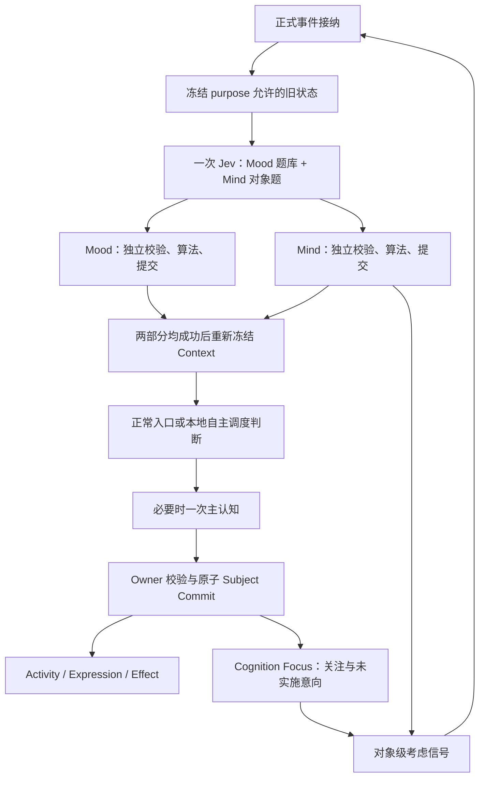

# ARMI 当前实现设计

心理事件入口为 `event.appraise → cognition.context.prepare → cognition.execute`。Jev 以一批问题评价同一事件和冻结旧状态，Mood/Mind 各自计算并提交；主认知读取新状态，无 Mood/Mind 写入能力。Mood 题库、情绪算法与时间参数保持不变。

数据库仅保留有长期用途的事实与保证正确性所需的当前状态。Web 搜索步骤、检索索引逐次生成过程写诊断日志；索引本体、来源版本、完整性和任务重试仍由原表负责。每个 Runtime 的启动恢复状态、起止时间和阻塞数直接保存在 runtime_instances，沿用实例 ID 关联恢复结果；过程与统计写日志，不另建恢复流水表或追加重复的启动检查审计。

语音服务调用的准备、发送、首个结果、完成与错误只写诊断日志，以轮次/会话和进程内调用 ID 关联，不建立独立调用流水表。实际供应商用量直接保存在对应 live_voice_turns 或 live_voice_sessions 的 provider_calls，按 call_id 登记并更新；结束后只允许补齐已登记调用的真实回执，不能登记新调用。重启结束未完成轮次和会话，不重放语音调用，已保存的用量保留。

候选校验与提交在同一次执行中直接传递已接受的修改及 Context 引用，不建立逐项校验表或候选引用中间表。拒绝仅更新 episode 失败状态，详细原因写日志；接受后的校验摘要、change set 和实际 application 保留，作为已提交业务事实的来源与幂等依据。Context 准备、模型排队/调用/格式拒绝、候选校验、Web 接纳/结算等技术过程写日志，不追加 audit_events；权限与管理变更继续保留正式审计。

本文描述仓库当前代码姿态，不是路线图。精确字段、状态、枚举、DDL、依赖和默认值以当前代码、`armi-postgresql-contract` 打包 schema、唯一 Alembic `0000`、`configs/`、锁文件和测试为准。

产品约束以本节及 [AGENTS.md](AGENTS.md) 为准。普通 Creator 回复与 Codex 委托均在配置范围内直接执行，中断即结束；管理端授权保持独立合同。

认知校验和落地结果统一保存在 cognitive_episodes：保留最终状态、变更制品和提交关联，供幂等检查、业务追溯与数据权利使用；不再独立保存候选校验表与候选落地表。校验过程及计数写诊断日志，原子提交、过期拒绝和中断终止规则不变。

能力目录由 Capability 模块的代码定义，不保存数据库表或安装时预置记录。Codex、摄像头、屏幕观察和生命记录查询共用目录；是否开启、是否可用及原因均读取当前 Runtime 状态。Context 保留稳定能力引用与版本，能力目录读取不需要数据库事务。

睡眠整理的当前阶段、完成标记和唤醒状态保存在 maintenance_sessions；实际整理成果保存在对应 cognitive_episodes，与阶段完成标记同事务提交。阶段切换过程写日志，Creator 整理记录仅展示已提交成果，不再保留完整步骤时间线。阶段令牌和 head_version 继续拒绝过期提交。

提示词的类别、启停状态、当前标记及内容历史统一保存在 prompt_revisions；未设置的 Creator/主体指导语没有占位记录。固定人格锚点不可改写，修改权限由类别决定；首次创建和后续修改共用按主体与类别的事务锁。

场景对象保存在 interaction_scenes，发言者保存在 party_input_interactions，不另存参与者名单。群聊中群本身与实际发言人分别保留，输入边界负责校验场景及发言者身份；数据库直接以场景主要对象及已接纳输入校验私聊/群聊作用域，避免删除名单后放松身份约束。

Context 的来源与版本只保存于 cognitive_context_items；不再重复保存依赖表。候选读取冻结来源，提交仍由各 owner 校验当前版本。

活动决定并入 activity_revisions；进度变化、思考来源和产出资料统一记录，不再单独存决定表。历史分页只读取活动修订，等待信息的时间从相应 wait 修订获取。

关系的稳定身份、对象、当前标记与历次内容统一保存在 relationship_revisions；同一主体、对象和范围仅有一条当前关系。隐私墓碑阻止后续使用该关系，历史涂除规则保持不变。

Cognition 拥有共享 `event_appraisals`，保存事件幂等标识、冻结输入与版本、两部分结果和一次 Provider 用量；Mood/Mind 分别拥有各自 revision。失败不伪造心理无变化，有效部分可独立保留。

记忆、生活资料和活动各自只保留一张历史表，同时承载稳定身份与当前标记。首条历史的生成标识为外部引用提供稳定目标；修改、删除及投影锁先锁首条历史，再读取当前内容，防止切换当前记录时漏掉并发修改。当前修订号承担并发校验，原始创建时间不随修改推进；隐私删除继续清理全部相关历史，资料的更新时间保留实际消费者语义。

固定的私有范围由各内容 Owner 合同保证，不在主体组件、Mind、Mood、经历、记忆、关系及活动记录重复保存；活动固定为 self_directed，外部证据按 external_claim 处理，机会接纳后即为 eligible，均沿用代码合同。Artifact 物理路径由 content_digest 按唯一存储布局计算，数据库只保留摘要。未启用的价格快照占位、恒定用量合同号及没有消费者的维护更新时间、时间线登记时间不持久化；真实用量、事件发生时间、算法来源和并发版本继续保留。

## 1. 目标与边界

ARMI 承载一个自主电子人长期存在。系统的首要对象不是“回答”，而是同一主体在时间中形成、读取和改变自己的生活事实；对话、模型、网页、Codex、QQ、语音和视觉只是她接触世界的不同机制。

交互与管理首先服务 Agent/LLM，链路应完整、直接、高效且可自动化；人类界面是第二优先级，不能成为机器完成用例的必经路径。能力在设置中开启即在配置范围内持续允许使用，普通回复作为基础能力直接可用，不额外设置申请、审核、批准或许可消费流程。瘦身针对无独立职责的中间状态、重复记录、校验和人工步骤；保留主体意愿、隐私范围、数据保护、原子提交、幂等与现实结果核验。既定破坏性管理操作边界不外推成日常能力审批。

当前固定边界：

- 单实例、单个出生后持续存在的 subject、单权威 Runtime；
- 模块化单体，不是多 Agent、微服务、多租户或多角色平台；
- PostgreSQL 是权威关系事实源，Artifact Store 管理大对象，派生投影可重建；
- 每类主体/生活/关系/权限/效果事实只有一个 owner 和正式写入路径；
- 客观记录、外部证据、第一人称经历、主观记忆分别建模；
- 意愿、授权和现实结果分别由 Cognition/Expression、Capability、Effect/adapter 回答；
- 模型与外部机制不可信，只能返回冻结合同内的候选、证据或回执；
- 对外副作用先登记，后尝试，再核验；unknown 是正式状态，不能用重试抹平。

## 2. 部署与进程拓扑

豆包语音的流式 ASR、双向 TTS 和录音识别统一使用新版语音控制台 API Key，通过 `X-Api-Key` 发送。`speech.volc_credentials` locator 指向单 Key 文本，设置与 CLI/MCP 共用保存用例；不解析旧 App ID/Access Token JSON，不复用方舟模型凭据。资源 ID、音色与凭据分别配置。

Setup 的凭据验证通过有界私有 worker 调用真实 Provider，独立于 Runtime 生命周期和 Subject Commit；不赋予交互端安装管理权限。各 Key 只验证所属供应商：已选文本供应商检查所选型号，另一家使用默认测试型号（千问 `qwen3.8-flash`、DeepSeek `deepseek-flash`），不修改聊天配置；语音另验证 TTS 生成及 ASR 识别。固定测试请求必须满足共用 Context 合同，包含当前输入与对应引用，保留后端严格 Schema 校验。保存状态与本次验证结果分开，错误只输出安全错误码与中文说明，并区分本地合同、服务商鉴权与响应错误；验证期间凭据改变则结果失效。网络 I/O 不占用设置文件锁。模型响应核验其身份；启动失败保留具体 ModelViolation 错误码。语音 WebSocket 与模型 HTTP 均不自动继承环境代理。

Windows 安装版采用 MSIX。Windows 管理只读程序目录，入口通过包身份查找资源；Known Folder API 定位的 `%LOCALAPPDATA%\ARMI` 保存永久数据。其下 `environments/active/` 保存数据库、配置、凭据、模型与生活数据，`control/` 保存设置、环境索引和独立管理与更新记录，`cache/`、`tmp/` 保存缓存与临时文件。MSIX 的目录虚拟化排除声明使这些数据实际落盘并在卸载后保留。开发验收使用独立包身份和 `ARMI.Acceptance` 数据目录。源码使用明确资源绑定；本次不迁移或修改旧 Inno 安装与数据。

```text
                         Windows local machine

 Creator browser ──HTTP/SSE──┐
 ARMI cli interaction / MCP interaction_* ──认证本机──┤
 QQ/NapCat ──OneBot──────────┤
 WASAPI / DirectShow / USB ──┤
                             ▼
                    ┌─────────────────┐
                    │  armi-runtime   │
                    │ authority + app │
                    │ 23 owner ports  │
                    │ durable workers │
                    └───┬─────┬───────┘
                        │     │
          short UoW/SQL │     │ governed artifacts
                        ▼     ▼
              PostgreSQL 18.4  Artifact Store
                 + vector/trgm   under environment/data

      model / Web / Codex / NapCat / device I/O occurs outside write UoW

 ARMI cli admin / MCP admin_* ──独立配置/角色/进程──► owner Admin ports
 Codex runner ──一次性 workspace；无 DB/Admin/宿主 secret
```

Runtime 是唯一正常活动写入者。Admin 使用独立进程、配置、credential、pool 和 owner 管理端口；Creator UI 不接触 Admin。ARMI→Codex runner 显式关闭 MCP，不能发现 Codex→ARMI Admin 链。

`armi-app` 是依赖 Runtime 与 Admin 的顶层分派包，按 GUI、CLI、MCP 模式仅加载指定入口；它不合并权限或业务用例，底层应用不反向依赖它。唯一对外产品入口为 `ARMI.exe`，机器模式保留标准流与退出码，GUI 模式不创建控制台。开始菜单与执行别名由 MSIX 注册；机器接入使用 `%LOCALAPPDATA%\Microsoft\WindowsApps\ARMI.exe`，不持久绑定带版本的包路径。随包 C++/WinRT 库只提供包身份、签名与部署、自启和进程管理接口。登录自启使用默认关闭的 Windows StartupTask，尊重系统中的用户禁用状态。

Windows 安装版按当前用户部署，不注册系统服务。私有 Python、锁定 wheels、已构建网页和原生 PostgreSQL 随包交付；`ARMI cli setup` / 统一 MCP 的 `setup_*` 与 Tk/ttk 窗口共用安装应用服务。首次配置只在明确的新目录生成独立凭据和绑定，完成数据库初始化后仍保持未出生，出生调用正式 owner 路径。托盘通过已有生命周期用例启停 Runtime、附属工作和所属数据库；关闭网页不停止进程。

桌面管理进程不拥有后台生命周期。CLI/MCP 可静默启动环境，桌面入口复用已有 Runtime；退出托盘仅释放桌面资源，不执行停机。停止保留托盘，停止并退出须先确认 Admin 停机成功，失败保留界面。托盘和设置独立显示真实 Runtime 状态，每 5 秒通过同一 Admin 查询刷新，不以 PostgreSQL 就绪或设置准备完成推断 Runtime 运行；Explorer 重启后重新登记托盘。注销或系统关机仍请求正常停机，系统强制结束沿用宿主 Job 的崩溃合同。

本地开发安装使用 `tools/install_local_msix.ps1` 重新构建当前源码，独立验收包采用 `年.月.日.当日序号`：本地日期、同日递增、换日从 1 开始，并高于发布配置、已安装包及本地输出记录；日期回退或同日序号耗尽则拒绝构建。版本分配仍在已有构建锁内，复用正式 MSIX 构建与 Windows 部署机制。已有验收环境的数据库合同须兼容，停机仍经 Admin；程序部署和业务启动分别验证。这个开发入口不上传 Release，安装后关闭验收实例的 GitHub 自动更新，不引入本地 HTTP 服务、另一套客户端更新源或文件替换机制。

本地构建输出不作为版本档案：`dist/msix-local/` 仅保留最新成功签名版本，新包成功后清理旧版，打包失败保留上一成功版本，部署失败保留本次已签名产物。完整 payload 和 staging 在退出时清理，日志只保留 `.tmp/local-msix-build/` 一份并于下次构建替换；`-BuildOnly` 遵守同一保留规则。

安装版环境宿主通过系统激活同一主入口的私有模式启动，持有禁止脱离、关闭即终止后代的 Windows Job。原生创建接口使用 `PROC_THREAD_ATTRIBUTE_PARENT_PROCESS` 绑定宿主父进程，并通过 `PROC_THREAD_ATTRIBUTE_JOB_LIST` 在创建时纳入宿主 Job；标准流只继承显式复制的句柄。这样长期进程不继承 MCP 客户端用于取消整棵调用树的 Job，CLI/MCP 调用结束不关闭宿主。正常停止仍经 Admin 授权，按 Runtime、附属进程、PostgreSQL 顺序完成。宿主不持有业务权限或成为新的事实 owner。系统会话结束、宿主崩溃或卸载导致的强制终止按崩溃处理；数据库允许正常恢复，未完成认知与回复仍中断即结束。

更新从 GitHub `YifeiLi99/ARMI` Releases 的 `armi-update.json` 发现候选，下载到数据目录的 `tmp/update/`。接受候选需核验可信 MSIX 签名、包身份、架构、递增版本及签名覆盖的包内数据库合同；只自动准备数据库合同一致的版本。Windows PackageManager 以延后注册选项管理替换；重启更新先停所属环境，停机失败不强行部署。控制目录保存更新状态，重启后以 Windows 实际版本判断部署结果，不把下载完成视为升级成功，不维护程序文件回滚。用户直接安装不兼容包可能完成 Windows 部署，但 ARMI 启动检查拒绝进入生活且保留数据，不承诺业务检查失败会自动降级。

原生 PG 管理器使用 `initdb` 初始化、`pg_ctl` 正常停止及数据库检查。安装版直接创建 `postgres.exe`，在运行前加入环境宿主 Job，避免 `pg_ctl` 的受限令牌启动链经系统激活后脱离宿主；源码环境仍用 `pg_ctl` 启动。包内 PostgreSQL 注册为同一应用的内部 FullTrustProcess，支持 `initdb` 的子进程激活，不增加公开入口。进程身份绑定可执行文件、命令行、创建时间、数据目录、持久端口及集群 system identifier。仅监听回环地址，使用 UTF-8、UTC、builtin `C.UTF-8`、校验和与 SCRAM；端口冲突失败，不连接占用该端口的其他数据库。系统测试通过同一管理器创建独立临时集群。

对外优先服务 Creator 委托的 Agent。交互绑定固定环境、Creator、delegate、凭据 locator 和读写范围；来源由认证入口写入 `party_input_interactions.delegate_id`，并进入当前输入与近期对话的 Context。代理不成为第二关系身份，不能用消息正文声明授权。

场合管理、Creator guidance、能力决定、数据权利申请与正式导出的请求也将认证 delegate 传到 owner 命令，由 owner 写事务记录 `creator_delegate` 审计来源；Creator 本人入口保持本人来源。业务参数不接受调用者自填的 delegate。

`armi-local-control` 共用配置加载、本机过程身份、进程锁及生命周期合同，不是业务 owner。交互客户端不持有 Admin 数据库凭据；Admin 按操作需要建连，因此数据库停止时仍可发现工具、检查本机进程和启动环境。

包卸载仍由 Windows PackageManager 完成，不交付独立卸载程序，也不依赖卸载前脚本。Windows 设置直接卸载保留数据；ARMI 设置的卸载窗口提供每次默认关闭的永久清理勾选框，CLI/MCP setup 共用 `uninstall` 用例，`delete_data` 默认 false。应用服务先经 Admin 停止全部登记环境，失败不继续。同一主入口的私有原生卸载模式等待请求方退出，持有部署互斥和卸载标志，复核环境已停、关闭当前会话同包客户端，再按包身份与 Known Folder API 定位唯一数据目录。清理前拒绝目录及祖先、子树中的重解析点；仅显式选择时删除数据，随后请求 Windows 卸载包。新入口在卸载期间拒绝启动。请求回执不等于卸载完成；清理和包卸载不具原子性，失败可能留下部分清理结果，原生错误窗口明确提示，不承诺恢复。保留数据后重新安装兼容包会核验已有环境身份和数据库合同，复用凭据与管理回执，不重新出生。正式签名与在线发布需单独配置；本地测试证书验收不代表公众安装或在线发布已经通过。

## 3. 分层与依赖

业务依赖方向是 `Interface → Application → Domain`，外部实现通过稳定 port 注入：

- **Domain**：值对象、不变量、候选/命令语义；不得依赖数据库、FastAPI、Provider/平台 SDK 或客户端格式。
- **Application**：用例、owner 协调、事务边界和稳定端口；不拥有外部连接细节。
- **Interface**：CLI、Creator HTTP/OpenAPI/SSE、Admin MCP、渠道 intake。
- **Adapter**：PostgreSQL、Artifact Store、模型、Web、Codex、NapCat、WASAPI、DirectShow、serial。
- **Composition Root**：读取配置与 secrets、核验环境/数据库、选择唯一活动适配器并组装 owner/worker。

业务模块公共面只在 `api.py`，组合入口只在 `bootstrap.py`，`_*.py` 私有。架构 gate 拒绝深导入、反向依赖、动态导出、公共 `Any`、合同同族并行数字版本以及生产 SQL 越权写表。

## 4. 事实所有权

23 个 owner 不是独立主体，而是同一主体的责任分区：

| 事实域 | Owner |
|---|---|
| 接触与感知 | interaction、perception、live-voice、live-vision、evidence |
| 进入认知 | opportunity（distribution: attention）、context、experience、cognition |
| 主观生活 | memory、relationship、activity、material、subject-state、mood、prompt、sleep |
| 意愿与现实 | expression、capability、effect |
| 外部工作 | codex |
| 治理 | data-rights |

数据权利的联系/使用计数随 `parties` 保存，由 Interaction 端口读取与推进；停止联系或使用后，旧任务仍因计数不符失效。身份匹配密钥的指纹随 `deployment_environments` 保存，由 Runtime 端口首次绑定，再次启动必须一致；Runtime 只拥有这两个绑定字段的列级更新权限。

记忆修订直接保存关联记忆与关联类型；关系修订直接保存来源经历与依据类型，维持每次修订最多一个关联、来源外键和重新建立关系时的经历防复用检查。主体记录保存经历整理游标，由 Runtime 端口在同一提交事务中推进；只有最终反思提交成功才推进已处理范围，中断不跳过未整理经历。

Owner 同时拥有本类领域合同、表、DML、head/revisions、幂等与并发语义、恢复检查、数据权利参与和 Admin 校正端口。`tools/schema_ownership.py` 把当前 46 张表逐一映射到 owner，并扫描 production SQL；跨 owner 改变必须通过公共端口与 Subject Commit，不能 join/update 别人的表绕过不变量。

## 5. 主体与连续性

连续性由 environment identity、subject、各 owner revision/head、因果引用、Artifact custody 和 Runtime authority 共同建立。模型会话、PID、网页 session、设备或渠道账号都可替换，不能成为“她是谁”的根。

出生只在已安装的空白生活环境中执行一次。当前 birth contract 建立：电子人 identity、唯一 primary Creator、空名字/兴趣/目标/偏好/价值、固定人格锚点、中性的二维 Mood 基线 和清醒 life mode。Birth manifest 不能嵌入经历、关系、自我描述等后天生活内容。

Runtime 拥有跨 Owner 的统一主体版本；Subject State 只拥有 Self 与生活模式，Mind 拥有数值心理状态与考虑信号，Cognition Focus 拥有持续关注与未实施意向。Mood/Mind 在主认知前独立提交并推进主体版本，随后重新冻结 Context；主认知中的其余多 Owner 变化仍在一次 Subject Commit 中原子提交。

## 6. 输入、Context 与认知

### 6.1 正式 intake

Creator HTTP/CLI、other-human 控制面、QQ、live voice、视觉/Web/Codex 结果都先形成稳定 interaction/evidence/opportunity 身份。重复 idempotency key 返回同一逻辑接纳，不产生第二段经历。外部媒体先成为受治理 artifact，再由 Perception 识别；识别文字不自动等于 sender 原话或主体记忆。

每个消息附件最多发起一次模型识别，请求、原始返回 Artifact 引用和 Provider 用量回执归入 `external_message_parts`，识别状态复用附件处理状态，不另建调用表。Perception 通过 Interaction 的正式接口登记与结算；请求标记防重复，调用前冻结数据使用版本，返回后仍核验来源可见性和使用版本。调用过程写日志；中断或停止使用后不恢复识别，迟到用量只允许补记已登记的调用。附件请求与原始返回参与同一 Interaction 数据权利发现、导出及 Artifact 引用管理。

### 6.2 Context

Context 以 purpose profile 冻结，而不是拼接所有历史。四层为 stable prefix、scope context、conversation history、turn tail；可选 section 闭集为 runtime truth、purpose、Self、Mind、Mood、Focus、life mode、scene、relationship、memory、activity、material、evidence、capability、prompt。

Profile 同时声明 required、optional、retrieval、forbidden：Creator 文本可召回 memory/material；Creator voice 当前只召回 memory；other-human 禁止 Creator prompt 和私人生活召回；视觉、Codex、睡眠各有更窄范围。最近对话只取同一 scene 最多八个已接纳真实事件。外部文件在快照事务外读取，最终 Context bytes、digest、来源与版本作为 artifact 固定。

### 6.3 Creator 单次认知

Provider 的文字区域拼接后为一份 Markdown 文档：唯一一级标题 `ARMI 本轮认知`，二级标题组织规则与资料分区，三级标题组织规则子节和带 `ctx:N` 的条目。来源、信任与隐私使用引用块，结构化字段使用嵌套列表；外层请求 JSON 和输出 Schema 保持原合同。外部正文及未知条目使用原文代码块，不修改正文中的标点、标题或链接；围栏长度大于正文中最长反引号串，避免正文打断自身容器。不同消息仍保留原角色与信任边界，不合并为系统指令。

Creator 文本、实时语音和 Codex 结果在 Provider 边界渲染为可读条目：中文标题与字段、原始 `ctx:N` 引用、来源性质、信任与隐私标记，以及业务正文。模型不再接收 binding、candidate base、摘要、重复引用目录与每条来源的数据库 ID/版本；这些信息仍完整保存在冻结请求中，由 Runtime 绑定及校验。已知 Owner 的人格、自我、心情、场合、对话、动机、关注和能力记录仅去除明确的内部字段，解开一层 JSON 后呈现；保留业务数值、时间、否定/空值、能力不可用原因、代理来源及当前对方是否为主要 Creator 的区别。未知条目和外部正文原样保留，不递归删除外部 JSON 的 ID、version 等字段，不改写或截断文本。输出合同所需的英文枚举保持原值，Schema 约束不变。

当前 `current_evidence` 正文独立置于最后一条输入消息；Codex 使用 `### Codex 返回 · ctx:N` 标题与原文代码块，正文旁标注引用与外部结果性质。历史发言只作为背景，本轮证据正文只出现一次；不将外部返回提升为系统指令。不依据文本相似度合并已有动机、删除未结束关注或改写主体记录。计量、请求留存与实际发送使用同一渲染入口，冻结 Context、引用编号及 owner 绑定保持不变。

所有认知用途共用一个 Provider 上下文组装器，不再保留旧对话消息计划或另一套提示词渲染路径。固定指令只描述基本规则、任务处理规则、行动、内心、情绪、表达和输出要求，专项维护只提供自身职责所需的规则；身份与人格只在资料区出现，本轮用途由冻结的 purpose 条目说明。资料区不重复规则开场白，专项任务不重复通用的状态变化和动机延续规则。具体条目按身份与人格、固定指导、本轮任务、当前状态、可用能力、相关背景、历史对话排列；空区省略，当前输入和证据另置最后一条。关注和动机是状态背景，不要求逐条处理。模型输出引用约束从同一冻结引用集生成。

冻结资料格式与模型可读文本分离：旧提示词格式不要求旧数据兼容分支，也不需要重建主体数据库。当前对方的 Creator 身份依据 owner 提供的 `sender_party_kind`，不能把场合的主要对方 `primary_party_id` 当作 Creator；非创造者私聊也会以当前对方为场合主要对方。非创造者对话的回复、事件评价和关系变化共用 2048 token 输出预算，与普通 Creator 对话一致。所有认知合同统一使用完整 JSON Schema 与 `strict: true`，非创造者对话不例外。结构化输出异常时排查 Schema、供应商结构化输出能力及适配，不得以关闭 strict 绕过；ARMI 的 JSON、合同、引用、owner 与原子提交校验也不放宽，不截取或修补非法返回。当前通用候选合同确实要求的 `candidate_base`、显式受托任务的来源 ID，以及专项反思的目标版本，仅在相应用途中单列提交字段；反思只有目标状态保留重建完整候选所需的 schema 字段，其余来源 ID、版本和摘要不重复展示。所有程序绑定、校验及原子提交语义保持不变。

持久心理状态和关注与每轮注意窗口分开：优先当前正式关联对象，其次到期信号，再轮换其余对象。长期对象数不限制；Focus 与数值动机合计最多四个重点对象进入主认知，未选中对象不删除。只有进入完整认知的冻结条件才消费，本地检查不提前消费。

记忆整理的首个 cognitive_episodes 保存冻结范围与最多 64 条有序 Experience ID，后续记忆整理和反思通过 maintenance_source_episode_id 关联它，不另建批次与来源清单表。经历内容始终经 Experience Owner 按当前可见性读取；进度游标只在最终 reflect_prompt 提交时推进。认知中断即结束，冻结范围作为长期整理进度保留，由新机会创建新认知使用，不续算旧候选。

精确生活查询的参数、work 和结果保存在来源 cognitive_episodes 的 life_query_* 字段中，复用主体、场景、来源和提交身份，不设独立查询意图表；查询结算使用独立状态，不能覆盖认知本身的完成或失败状态。

标准 Creator 文本、语音和精确生命查询结果先经过独立 Mood 评价，再执行主认知工作；文本生成仅允许下述五次格式重试，语音仍单次调用。当前 Creator 合同将 `decision` 与共同的 experience、changes 分开；decision 支持 reply、decline、no_action、no_change、defer、need_information、exact_life_query、visual_observation。回复只携带 content，查询、搜索和视觉观察各自携带参数。终止决定可以有 content，也可以自主沉默。

模型只提出业务决定，不能生成 subject/scene ID、revision/version、权限结果、最终情绪与心情数值、usage/model identity 或现实结果。关系/承诺变化必须有 experience；记忆只在当前 Creator 明确要求记住时形成，memory_summary 的存在代表记忆提议，不再另传 remember。主模型读取 Mood 的结果，独立 Jev 适配器提供事实评价。语音复用相同业务类型，仅顶层字段别名和 60 字表达上限不同。

### 轻量自主判断与完整认知

Attention 持有唯一调度状态。没有待处理人类输入、活动认知、实时语音或睡眠维护，回复 Effect（含待执行状态） 已结束且安静满 60 秒后，创建 `consider_autonomy_check`。首次间隔 60 秒，连续不行动为 120、300 秒，此后保持 300 秒；完整认知产生行动或活动推进时恢复 60 秒，等待和延期继续退避。人类输入、工具结果、到期活动与关切可缩短等待，信号按来源版本消费，轻判启动至少相隔 60 秒；普通工作完成与时钟刷新不触发额外认知，不补跑积压轮次。

自主检查在完成联合 Jev 评价后，根据新 Mind 信号、正式活动和 Focus 复查条件进行本地判断，不调用主模型，不生成模型候选。精简 Context 仍保留来源和版本，检查结果只是调度事实。

自主检查与后续完整认知复用来源事件的共享 Jev 回执，不重复刺激或计费。检查只提交 Attention 调度；符合条件时原子创建唯一后续认知，并重新核验主体版本、冻结 Context。未调度不等于主体决定沉默。

人类输入取消尚未提交的两段自主认知和排队机会；已提交效果遵守原执行合同。后台工具未返回不阻止其它活动，但不能重启同一任务。技术失败和不行动分开记录：临时失败按 60→120→300 秒创建新机会，配置/鉴权失败等待配置修正；最多五次格式重试只作用于同一冻结请求，传输 unknown、业务拒绝与状态冲突不重试，失败始终在聊天渠道静默。重启取消旧判断和候选，不恢复旧轮次。

`autonomy_plans` 只存阶段、调度、退避和最近判断关联；两段用量从 `provider_usage_calls` 汇总，不建第二份计数账。CLI/MCP、管理状态及 Creator 页面显示相同合同。只维护当前数据库及配置合同，不提供旧库与旧配置转换。

2026-09-21 的主模型轻判实验属于已删除链路，历史延迟与输入用量不能用于当前本地调度。当前离线测试检查不调用主模型、未调度的真实状态与完整认知中的条件消费；真实 Jev 延迟和费用仍待授权校准。

### 6.4 Subject Commit

Creator 文本和语音候选直接绑定为内部提议及 Owner 草稿，只构造一次公共认知候选。行动、经历、评价和资料/关系变化共用这次绑定，不经过旧版对话决定模型或复制候选再补字段。Self、Focus、Prompt 的反思及既有记忆维护由各自 purpose 入口处理；保留当前合同中的语义评价与 concern changes。

```text
frozen Context + expected subject/owner versions
  → model attempt outside transaction
  → strict parse + reference validation
  → each owner validates its command
  → transaction checks runtime fence / work lease / subject / versions
  → all accepted owner revisions + cognition application + subject version
  → commit
```

执行器将实际模型响应、usage 与模型成功以短事务保存；文本格式重试期间认知保持 `calling_model`，选定最终返回后进入 `finalizing`。最终响应直接传入校验器，类型化变更集直接传入提交服务；受治理存档保留，正常执行不重读存档接续工作。制品在事务外准备，最终事务原子登记校验、应用事实、主体变化、意图、Effect（含待执行状态） 并结算工作；全程共享同一租约、续租和取消信号。后续失败不改写已成功的模型调用。

模型响应制品使用 `armi.model-response-artifact`，只保存供应商身份、原始输出文本和 usage，不重复保存候选正文。适配器不解析业务候选；Cognition 使用原合同解析器判断文本是否需要格式重试，选定最终返回后仍由正式校验器绑定 Owner 命令。最终校验的阶段、错误码、字段路径和责任 Owner 只写诊断日志，以 episode/attempt ID 关联原始返回；不生成诊断制品。格式错误返回仍保留独立 attempt 与原文，格式拒绝写日志，不追加技术审计。调用成功事实与内容拒绝分开记录，不改写为网络失败，也不提交被放弃的候选。

Admin `cognition_read`（CLI `cognition-read` / MCP `admin_cognition_read`）按 episode ID 返回 Context manifest、compiled Context、各 attempt 的请求/响应引用；给定其中的 artifact ID 后分段读取经过完整性核验的 UTF-8 正文。offset/length 以 Unicode 字符计，默认 16384、单页最多 65536 字符；返回 next_offset，不解析或执行历史候选。独立 `cognition_read` scope 授权正文读取，本机拥有者包含此权限，普通 trace/diagnostics 权限不自动获得正文。只读取该 episode 直接引用且仍 retained 的制品；文件 I/O 在事务外，返回前重验退役状态，缺失、损坏、越轮引用分别明确失败。

新调用的 `model.request` 制品采用 `armi.model-input-evidence`，保存实际 provider_request（系统指令、输入、输出 Schema、模型及生成参数），由与 SDK 发送共用的参数构造方法生成，不重复保存相同输入，不含凭据或认证头。确定性心情计算明确标记 deterministic，只保存 canonical_request，没有 provider_request。历史请求仍按原始字节读取，缺失的旧系统指令不按当前配置重建；attempt 的 dispatched/result 状态用于区分已准备输入和真正发生的模型调用。

Owner draft 在进程内携带已绑定的不可变领域对象。Subject Commit 直接按 Owner 收集这些对象，不从存档 JSON 重建命令，也不再注入八个仅供重复解码使用的 Cognition ports。canonical payload 用于已接纳提议的留证与摘要，不作为恢复或执行入口。

任一提议或 Owner 拒绝即拒绝本轮全部提议，不跨 atomic group 保留其余变化，也不剥离内部变化后单独发送回复。当前执行状态仅 accepted/rejected；历史 partially_accepted 记录保留为事实，提交入口不再接纳该状态。拒绝诊断保留各失败提议的 Owner、代码及提议路径。

Context 中不存在的活动操作、关注引用或情绪轨迹不能出现在可执行候选入口；已有对象的引用按种类绑定，不能把关注当成情绪 episode。供应商适配只共享完全相同的 Schema 子节点并缩短定义名称，不删除字段语义或约束。已有对象更多时 Schema 会相应增大。

分词和实际调用使用由类型生成的同一 Schema，不再复制整份对象手工拼接动作分支。自省 no_change 可以携带依据；更新按目标类型要求对应状态和版本。记忆维护将保留操作与重解释分开，重解释的关联引用与关系种类组成一个可选对象。Owner 继续核验有效引用和业务语义，提交继续核验异步期间可能变化的权限、版本、Runtime 和租约。

数据库当前基线保留历史候选版本，不将旧制品改写成新输出。旧候选没有执行解析器，也不参与中断恢复。

Creator 文本与语音的资料、关系和承诺变化使用同一按操作区分的类型。资料创建与更新共享内容结构；承诺修改区分范围更新与内容更新，关系边界区分限制与结束联系，不再通过通用 metadata 字段隐藏依赖。

其他人对话 v9 将决定与 social 经历组成部分分开：关系变化必须附着经历，非空关系变化及承诺字段依赖由类型表达。沉默、延期可以附带说明，Expression 保存原决定种类并独立登记表达。空白和 NUL 由同源 Schema 与结构解析提前拒绝；UTF-8 制品字节容量仍由 Expression Owner 拒绝，诊断定位 `decision.content`。主动表达并入自主生活的一次认知；旧主动联系合同不再有执行解析器。

通用认知按 Owner 区分状态载荷，主模型不能提交 Mood 或 Mind 变化。自主生活共同提交有界行动和可选表达；资料交 Material，关注与未实施意向交 Cognition Focus。具体活动的复查、等待与恢复条件保留。反思和维护在生成 Schema 与解析时选择当前 Owner／阶段类型。

拒绝、需要信息等决定附带表达时，Expression 同时保留原决定类型与表达意图；是否有表达意图决定发送，不能把原决定改记为 reply。资料、经历和评价不因是否表达而丢弃。

认知文本的非空白、NUL 与长度规则直接定义在字段类型中，供应商 Schema 不得删掉约束。Mood 使用独立离散评价合同；普通对话 Schema 不包含旧 appraisal 或 event_* 字段。Focus 变更、语音别名、资料字节限制继续由各自合同和 Owner 保护。

Schema 格式合法不等于业务提交成立。引用、版本、权限、资源容量与互相冲突的业务变化仍由责任 Owner 拒绝；Mood 独立校验 Jev 返回字段、离散选项、概率及用量，失败即终止依赖它的认知，不修补回答、不切换模型。

唯一候选解析同时遵循 JSON Schema 的数值语义：`60` 与 `60.0` 都是值为 60 的整数，进入严格领域类型时统一为 int；字符串 `"60"`、布尔值及有小数部分的数不转换。原始模型响应仍按原文保存，不用字符串转换或四舍五入修补非法字段。

以下列出主认知合同的责任。每个正式接纳的源事件均先完成独立 Mood 评价；这些合同只读取心情。Schema 体积随当前绑定生成，不在这里保留旧合同的字节快照。

| purpose／入口 | 合法工作及责任 Owner |
|---|---|
| `consider_creator_input`、`consider_life_query_result`、`consider_requested_visual_observation` | 表达／沉默、精确查询、Web 搜索、视觉请求；Cognition Focus 关注、Experience、Memory、Relationship、Material 与 Expression |
| Creator 实时语音 | 与 Creator 文本相同的业务动作，Expression 保留 60 字表达上限 |
| `consider_other_human_input` | 回复、沉默、延期、结束联系；当前对方的 Experience、Relationship 与 Expression；沉默和延期可附带说明 |
| `consider_autonomous_life` | 创建、推进、等待、完成或放弃活动，沉默／延期／需要信息，独立表达，以及已开启的查询、搜索、视觉和 Codex；Activity、Material、Expression 及工具 Owner |
| `consider_sleep` | 入睡、保持清醒、延期、缺少信息；Sleep |
| `consider_codex_result`、`consider_codex_task` | 证据理解及用途允许的 Owner 提议；Codex 委托只从显式任务用途进入 |
| `consider_visual_observation` | 忽略或形成视觉经历、更新关注；Experience、Cognition Focus |
| `maintain_subjective_memory` | 记忆保持、巩固、淡化、遗忘、重解释；Memory、Sleep |
| `perform_subject_self_check` | 保持或发现内部问题；Sleep |
| `reflect_self` | 保持或更新 Self |
| `reflect_focus` | 保持或更新 Cognition Focus |
| `reflect_prompt` | 保持或更新 Prompt |

所有对话处理技术失败统一静默结束，包括 Context、模型、候选校验、输入识别、Web、Codex、视觉和发送失败，以及五次格式生成耗尽、发送 unknown。Interaction 的统一失败入口只记录错误码与关联输入/机会的诊断日志，不生成错误正文、系统通知或发送 Effect（含待执行状态），不伪装为正常主体决定。原 Owner 保留真实失败状态、原始返回、计量和诊断，管理端仍可查询。实时语音只结束当前失败轮次，不播报错误、不转文本补发。

技术失败只保留日志、诊断和真实失败状态；不保留系统错误通知表、通知发送链或历史通知展示。Effect 统一关联实际动作意图。

任一 owner 失败不留下半个主体变化。并发版本已推进时旧候选 stale，不能最后写入者覆盖。正式模型请求前的 token 计数暂时失败，在当前执行租约内按剩余 work 尝试预算重试，间隔 1 秒；每次物理调用保留独立 Provider 回执，已登记用量身份不等于模型请求已发送。重试不重新排队，停机、取消或租约丢失立即结束；Provider 已受理但结果 unknown 时不再调用。文本格式重试遵守下述独立上限，不与 SDK 或 work 重放叠加。

Qwen/DeepSeek 主文本认知仅对完整返回中的非法 JSON、未知字段、缺失字段、非法枚举或候选合同不合格，按同一冻结请求最多生成 5 次（首次加最多 4 次重新生成）。Context、人设、Schema、模型和采样参数不变，不附加纠错提示、不补写或删除字段；每次生成使用独立 cognitive_attempts 记录与 Provider 用量回执，复用同一请求制品并保存各次原始返回。首次结构合格即停止重新生成，Owner 校验、制品准备和 Subject Commit 只进入一次；第 5 次仍不合格则交正式校验路径拒绝并产生最终诊断，聊天渠道保持静默。结构合格不代表权限、状态版本、引用对象语义及业务准备一定合格，这些失败不重新生成。协议不完整、工具调用、供应商拒绝、网络错误和 unknown 不进入格式重试。独立方舟语音保持单次生成。两次生成之间中断也结束旧认知，重启不续试或重置五次预算。

精确生命查询和网页研究是后续耐久 work：结果形成新证据和新 episode，并通过 Owner 的来源引用关联原操作，不在原 episode 偷加第二次模型调用。

## 7. 数据模型与读取

### 7.1 权威关系事实

PostgreSQL 保存 subject、life、work、effect 与治理事实。多数可变事实使用 append-only revision/event + current head；写入携带 expected revision/subject version。数据库 statement time 提供权威时序，UUIDv7 提供稳定身份。

当前表、字段、owner、关系、约束、索引与 ACL 的实现派生目录见[数据设计](docs/03-数据设计/)。该目录是 baseline 的只读说明，不替代 packaged SQL、owner registry 或测试。

### 7.2 Artifact

物理 bytes 按内容寻址；逻辑 artifact 保存业务用途、privacy、MIME、size、digest、publication 与 lifecycle。一个物理对象可被多个逻辑事实引用。发布预约、核验、退役和物理删除分开；逻辑删除只有在引用清空并满足 grace 后才形成物理删除 work。

### 7.3 客观记录与主观记忆

- Interaction：谁在何时通过哪个 scene/contact 发生了什么；
- Evidence/Perception/Web：外部观察与识别证据；
- Experience：被主体接纳的一人称经历；
- Memory：当前可访问、可淡化、可重释或遗忘的主观记忆；
- Diagnostics/Audit：系统行为证据，不能进入普通认知补全遗忘。

### 7.4 派生投影

Embedding、关键词索引、列表投影、游标和前端缓存可删除重建。语义召回仅覆盖 current accessible memory 与未删除 material：固定 Qwen 1024 维 embedding，HNSW/halfvec 取稠密候选，GiST trigram 取关键词候选，原向量/真实词相似度精排，owner 集合 SQL 复核资格，再用 RRF 融合。投影 binding/profile/head/coverage 不符时不得进入 Context。 建索引失败详情只写轮转诊断日志，包含任务、来源引用、版本、错误码及重试计划，不记录正文；日志不代表恢复事务已提交。重试和终态仍由 durable_work 与索引覆盖状态负责，不另建失败留档表。

## 8. Mood

处境标识表示事情的身份，不是消息身份。同一批成果的复评、表扬、感谢、重复确认和正常收尾应关联原处境；独立的新对象或另一批任务保持独立。回到较早处境时不默认关联最近一件事，评价只读取该处境的损益，不能混入其他任务的错误；只提成果的一部分不降低整体完成度或目标重要性，除非存在新的变化依据。这些语义由 Jev 评价，不以本地关键词改写答案或合并真正的新事件。

### 每个事件的心情变化判断

产品约定（2026-09-22 确认）：任何事件都必须经过一次心情变化判断，包含聊天事件、自我触发事件及外部信号事件。事件不能先被“是否值得完整思考”“是否需要回复”或“是否采取行动”的判断筛掉，再决定是否评价心情；自主轻判决定不进入完整认知，也不能代替或免除该事件的心情变化判断。

每次判断都要有明确结果：需要更新心情评价，或经判断无需更新。心情不变是合法结果，不要求每次产生新的情绪、增加刺激或改写心情数值。候选字段缺失、未执行、失败或结果未知不能充当“已经判断不变”；重复思考旧事仍须判断，但不能据此重复叠加同一刺激。

正式链路为 `event.appraise → cognition.context.prepare → cognition.execute`。独立 Jev 适配器每个事件只调用一次，固定 `jev-1.13.0`，失败或中断不回退；完成心情提交后重新冻结认知 Context。同一来源与版本复用评价，轮询及 Mood 通知不产生事件。

Mood 在主认知之前独立结算，主模型失败不撤销已经形成的心情。模型调用在事务外，结算重验租约、主体与 Mood 版本；停止后不续算旧任务。主模型候选已删除 Mood 写入字段，反思不再绕开 Jev。

### 处境评价合同与算法

Mind 与 Mood 基于同一事件、同一冻结旧状态共享一次 Jev 请求，各自校验并独立提交。Cognition 拥有 `event_appraisals` 协调记录、冻结版本、两部分结果引用和唯一 Provider 用量；通过公开 port 请求两个 owner 写入，不跨域写表。合法结果不因另一部分失败或后续主模型失败而撤销。两部分均成功或明确无变化后，才重新冻结 Context 并进入主认知。技术失败、中断和 Provider unknown 不重试、不补答，不记作心理无变化。

Mind 采用三类心理需要和两组认知状态，不称为统一五维量表：

| 领域 | 评价与输出 |
|---|---|
| 自主 | 自愿认同/选择支持、强迫/意愿冲突，分别形成满足与受挫 |
| 胜任 | 有效应对/掌握、自身应对受阻，分别形成满足与受挫 |
| 联结 | 关心/接纳、排斥/关系受阻、期望联系缺口；未聊天时长不直接产生联系需求 |
| 探索 | 信息缺口 G、可理解性 C、信息价值 V、学习进展 P、新奇性 N；动机为 `G*C*max(V,P,0.5*N)` |
| 投入 | 意义 M、刺激不足 U、过载 O；适配为 `M*(1-max(U,O))`，调整动机为 `max(1-M,U,O)` |

情境锚定的五档 Choice 映射 0、0.25、0.5、0.75、1，另含 unknown 和 not_applicable。每次最多四个正式来源对象，每对象最多十五项变量和重要性、关联状态、当前机会三项条件，最多新增 72 题。满足与受挫独立，概率和置信度不作为强度。有意义的休息不因简单就算刺激不足，平台故障不能直接解释为主体无能。

同对象新证据替换评价；重复事件或原样评价不累加强度。未知保留旧事实并标记质量，未知指标不参与主动触发。出生为空且未评价；状态持续至证据或来源改变，不随时间制造需要。只有近期注意权重按 30 分钟半衰期衰减，查询只读。映射、阈值与半衰期集中于 [MindParameters](modules/mind/src/armi_mind/_state_algorithm.py)，均为尚未实测校准的工程初值。

考虑优先级为重要性乘探索、调整投入、三项受挫和联系需求中的最大值。首次达到 0.6 可产生对象级 ConsiderationSignal；降至 0.4 后重新达到阈值、动机相对已触发条件变化至少 0.25、机会恢复或明确复查到期，才重新具备资格。同一条件只消费一次；评价版本或消息数量不重新触发。多个动机合并，主认知最多收到四个重点对象。用户输入、活动结果和正式复查保留自身入口，不受心理分数筛选。

变量依据：[基本心理需要满足与受挫](https://selfdeterminationtheory.org/wp-content/uploads/2015/01/2014_Chen-et-al._need-satisfaction.pdf)、[PACE](https://pmc.ncbi.nlm.nih.gov/articles/PMC6891259/)、[学习进展实验](https://www.nature.com/articles/s41467-021-26196-w)、[MAC 投入模型](https://www.erinwestgate.com/uploads/7/6/4/1/7641726/westgatewilson.psychreview.2018.pdf)。这些研究支持变量与因果假设，不提供这里的电子人数值公式。[Jev 官方合同](https://docs.typesafe.ai/primitives)支持共享输入、各题独立的批量评价。题目见 [对象题库](modules/mind/src/armi_mind/_event_questions.py)。

Mind 提供领域、对象、依据、时间、质量和考虑信号，不提供总分、消息、工具参数、权限或采样参数。主认知可以继续、换方法、联系、等待或放下；真实效果经 Expression/Activity/Effect 登记、执行和核验。

Mood 以 Scherer 的 16 个评价维度组织离散问题，按已有目标展开；收益、损失及刺激正负性质分别保留。unknown、不适用与明确无影响分别表示。Jev 返回概率和置信度独立保留，不作为情绪强度。完整题目、锚点、研究依据见 [心情设计正文](docs/02-系统设计/05-情绪、心情与私有心情窗.md)。

正式题库采用中文对象限定提示：每题独立携带主体、评价对象和问题，self 固定指 ARMI；引语说话者不自动成为主体。报告事件与当前询问、提议、玩笑区分，收益、证据和阶段共用对象规则；已有目标的进度预测仍保留未发生结果的阶段。按目标展开的问题追加独立目标范围，不互相污染。核验背景不因转述而失效，无损与维持原状不自动等于充分获益，未知时限不等于无压力。

目标重要性与完成比例分别评价，目标贡献取两者乘积；普通目标完全达成不等于核心目标达成。刺激本身的喜好不能重复计算目标收益，感激要求有依据的目标收益。收到交流行为与话中外部结果的核验状态分开判断。

Choice 消费合同：Mood 与 Mind 均直接采用 Provider 返回的合法 `choice`，不因另一选项概率更高而拒绝，也不在本地重算 argmax、改选或重试。概率与置信度不决定心理强度。字段完整性、题目和选项集合、类型、有限数值、取值范围及概率和仍校验，缺失、虚构选项和非法数值仍明确失败。该消费约定由用户明确于2026-09-22调整；此前实验的最大概率拒绝属于历史实现，不再作为当前阻断条件。

同一处境有新证据时替换短期贡献，保留已经积累的慢状态；原样评价不重新充入刺激。重复事件幂等。情绪匹配由本地规则决定，支持高兴、悲伤、希望、恐惧、愤怒、内疚、自豪、羞耻、感激、惊讶、释然及失望；必要事实未知时不补出结论。释然需要关联旧威胁与已确认解除，羞耻需要明确整体自我评价。

整体感受仅包含愉快度和激活度，范围 [-1,1]。短期贡献半衰期 300 秒，慢状态恢复半衰期 3600 秒，短期与慢状态按 0.7/0.3 合成后 tanh 饱和。解析时间更新保证查询频率不改变结果；激活度不表示疲劳。权重和时间常数属于待校准工程选择，不是人类心理准确率。

离线验证分开检查算法、评价可靠性与后台行为。`tools/test_mind.py` 回放冻结 Choice 和连续轨迹，不调用模型。`tools/experiment_psychological_context.py --output-dir <新目录>` 默认生成同一批合成场景的 Mood 与 Mood+Mind 请求、固定预期关系和汇总。真实运行须另给专用隔离实验目录及 `--live --allow-billable`；不读取本机主体环境。保存全部返回及失败、题数、输入 tokens、用量、p50/p95 延迟；不能定价的费用明确标 unknown，须对账才能判断成本。所有模式主 LLM 调用数为零。尚未进行真实 Jev 校准，Schema 通过不代表心理效果已验证。

2026-09-17 的旧主模型心理评价实验只适用于当时已删除的合同，不能作为当前 Jev 模块的准确性、延迟或费用结论。

文本主认知只允许 Qwen 或 DeepSeek，默认 Qwen3.8-Flash，方舟不再属于主模型选择或回退路径。两家均通过 OpenAI SDK 使用官方 Responses 接口，`reasoning.effort:none`。Qwen Responses 当前未列出 JSON 格式约束参数，因此只通过提示词要求 JSON，并显式设置 `store:false`；不发送可能被忽略的格式参数。DeepSeek 使用官方 `text.format.type:json_object`，不发送 `strict` 或服务端 Schema。两家共用候选生成 Schema，无变化的可选字段省略，不套用严格供应商的全字段必填扩展。Creator 文本认知及复用该合同的结果处理、普通他人对话采用浅层输出：根对象直接放 action/content，删除 candidate、decision、social、relationship_change 包装；experience 为经历正文，experience_uncertainty、memory_summary 按用途保留，关系解释、事实、边界与承诺各自为顶层可选字段。Mood 评价由独立 Jev 链路负责，主认知不返回事件情绪评价；多条关注目标及主体变化仍用对象列表，保留关联关系。其他 purpose 和独立方舟语音合同不变。

浅层投影由 Cognition 所有：生成 Schema 从已绑定的原合同机械投影，解析入口按冻结的 candidate_contract_kind 选择对应编码，严格拒绝旧包装、未知字段及缺失依赖，不根据返回形状猜测版本。映射只重组字段，不补状态、不推断身份、不吞非法字段；模型原始文本仍原样保存在 response artifact，映射后交给原后端类型及各 Owner 校验。业务候选版本和数据库合同不变，无历史候选重放或数据迁移。普通回复最少为 `{"action":"reply","content":"在呢"}`；有关系变化时保留经历和非空关系解释。承诺引用只指向冻结 Context 中的关系承诺。Context 隔离、原子 Subject Commit 和 Effect 链不变；格式错误按上述五次预算显式记录并重新生成，不能靠关闭校验、修补 JSON、隐匿失败或切换模型解决。

DeepSeek 的 JSON Output 指南要求 JSON 指令与样例。主文本模型提示保留回复和主体候选示例，不再包含 Mood 评价或 event_ 字段。非思考采样保持 Qwen temperature:1.0、默认 top_p，DeepSeek temperature:1.3、top_p:1.0；后端仍严格验证主认知候选。

回忆表达必须核对当前对方与资料中的当事人；其他人的经历、自身心情及熟悉口吻不能替代当前对方的历史依据。Context 缺少相应历史时应明确不知道或不记得。此提示不补回被裁剪的历史，也不能保证模型不再编造；内容正确性与 JSON/Schema 合格分别验证。

两家各自使用 `model.qwen_api_key`、`model.deepseek_api_key`，目的分别为 `model.request.qwen`、`model.request.deepseek`。官方域名与供应商对应校验，千问允许北京通用域名和北京 Workspace 域名；不能通过模型配置把 Key 发到任意代理地址。`model.ark_api_key` 仅供独立豆包语音认知、视觉识别与网页搜索等原有方舟用途。语音绑定保持独立，不因未配置方舟 Key 阻断文本模型构造；实际语音调用缺凭据仍明确失败。

Runtime 持有并复用客户端，按服务地址、超时与凭据身份隔离，停机在工作退出后关闭全部客户端。SDK 自动重试关闭，生成结果未知不自动重放。Qwen/DeepSeek 没有复用方舟分词接口：预检将实际请求（含 Schema）的 UTF-8 字节数加 1024 作为保守本地输入预算估计，可能比真实 token 数大；它不是服务商分词结果，不写成收费 usage。实际用量只来自 Responses 的 input/output/cache 字段，映射到共同计量单位并保留原 usage。缺失价格沿既有合同显示待计价，不套用方舟价格。独立方舟语音仍使用官方 `arkruntime` 的 tokenization/Responses。服务端请求 ID 留在 Provider 回执，错误诊断不暴露凭据或正文。

生成提示按后端原 Schema 的 required 区分必填与可省略；无变化省略可选字段，有实际意义的评价和状态变化仍须完整填写，不为减少输出隐藏变化。后端原本允许的 null 或空数组仍合法，适配器不在返回后补字段。生成 Schema 保留非空关系理解等必要的较窄约束，不称为与后端完全相同。普通他人边界中 contact/exit 会阻止回复；address 仅为称呼限制，privacy/disclosure 分别为隐私与披露限制。“别拿这件事开玩笑”“先别给建议”等仍允许聊天的偏好保存为对方表达事实及关系理解，不扩大为停止联系，不自动生成承诺。提示与字段描述解释已有行为，后端合同版本及领域校验保持不变。DeepSeek 显式使用官方 `tool_choice:none`，只生成候选消息；这不保证消除非法 JSON 或 DSML 标签，仍严格拒绝异常返回，不做截取或修复。

实验选型约定（2026-09-20）：后续主聊天实验优先使用 DeepSeek `deepseek-flash`；Qwen `qwen3.8-flash` 保留可选，结构化输出稳定性与响应耗时仍有待调整、验证的问题，仅在明确进行 Qwen 专项或供应商对照时测试。该约定指定实验优先级，不表示 DeepSeek 已长期稳定，也不等于已切换安装环境或修改产品默认模型；两家的后端严格 Schema 校验要求一致。

接入依据（2026-09-20 核对）：[Qwen Responses](https://help.aliyun.com/zh/model-studio/qwen-api-via-openai-responses)、[DeepSeek Responses](https://api-docs.deepseek.com/zh-cn/api/create-response/)、[DeepSeek JSON 模式](https://api-docs.deepseek.com/guides/json_mode/)。JSON 模式只约束 JSON 格式，不保证符合业务 Schema；完整 Schema 提示及合法示例帮助生成，后端校验才决定候选能否继续。官方工具调用的 strict 说明不能直接当作 Responses 严格 Schema 能力的证明。单次回放通过不代表全部 purpose 或长期稳定性通过，新供应商仍需正式对话验收。

2026-09-20 格式约束复核：[DeepSeek Responses 兼容说明](https://api-docs.deepseek.com/guides/responses_api/) 声明支持 text.format，但实测不能将请求被接受视为硬约束已经生效。原始 HTTP 单个 output_text 在 json_object 的 none/low 思考对照中都出现过非法 JSON，响应仍为 completed；改用文档列出的 json_schema 后，非创造者冻结请求也复现了非法 JSON。进一步去掉 ARMI Context、人设和业务 Schema，只要求一个 reply 字段且 enum 唯一值为 SCHEMA_OK：提示要求不同值的八次对照中两次违反 enum（未指定 strict、试验性 strict:true 各一次），提示与 Schema 一致的四次对照均通过。该反例说明问题不只发生在复杂业务合同，也不能由 SDK 拼接解释；它不证明服务端内部故障原因，亦不证明所有业务错误都来自供应商。证据位于本地 .tmp/deepseek-documented-schema-20260920、.tmp/deepseek-schema-enforcement-20260920 和 .tmp/deepseek-schema-enforcement-repeat-20260920。保留当前生成配置及后端严格校验，不为宣称修复而补括号、删字段或静默重试；稳定性问题尚未解决。

模型侧按上述协议提供生成控制，独立方舟语音仍发送严格 Schema。Schema 中联合分支的 discriminator 字段放在分支正文之前，让生成先选择动作再填写参数；这只调整提示顺序，不改变可接受的候选或校验合同。收到可留存的返回与其可用于认知分开：Responses 要求 completed，且没有工具调用、拒绝或思考正文。Cognition 保留原始正文和用量；只有满足上述条件的文本候选格式错误允许有限重新生成，其余无效返回以具体错误结束 episode，不提交或补答。调用返回事实保留，成功返回不等于本轮业务完成。

### 心理与自主行动的目标架构

正式链路共享评价输入，Mood 与 Mind 无本轮输出依赖：



`consider_autonomy_check` 只作本地调度判断，没有主模型候选、调用或主体提交；没有可考虑条件时记录 `not_scheduled`，不伪造主体决定沉默。基础自主计划到期形成正式事件，轮询只读。保留至少 60 秒间隔、输入与发送占用、睡眠及维护限制。完整认知正常路径一次主 LLM；普通文本既有格式重试合同不变。

### 持续关注与好奇

Cognition 的 Focus 以 `focus_revisions` 持久保存有依据的问题、未实施意向、理由、结束条件、当前认识、等待与复查。每轮最多四项变更，不限制长期保留数。新认识在正常主认知形成；维护中的 `reflect_focus` 使用相同关注变更合同，不新增每轮反思调用。关注不强制成为 Activity。

Runtime 启动时构建所有主认知适配器，`reflect_focus` 只使用 Focus 反思合同。冻结 Context 接受独立的 `focus` 分区，保留条目来源与版本。隔离启动检查同时覆盖已配置模型与缺少所选模型凭据：后者以 `RUNTIME_MODEL_UNAVAILABLE` 降级，具体模型错误码写入诊断，不充当生命周期状态码。完整隔离对话只替换外部 HTTP 返回，检查共享评价、主认知、Subject Commit 和回复交付，并断言一轮只有一份评价记录与一次主模型尝试。

Jev 传输将重复的 Mood 处境范围、Mood 边界和 Mind 对象边界原文放入共享 `state.evaluation_rules`，各题只引用自身原有规则。Owner 题库、情境锚点和选项保持不变，原本没有额外边界的题目不增加该引用。此去重用于满足 [Jev 官方模型限制](https://docs.typesafe.ai/models)：整请求 64k tokens，共享状态加最长单题 32k；不拆分收费请求或收到拒绝后重试。2026-09-23，89 题请求去重后实测 48,014 输入 tokens，四对象 117 题合成请求实测 57,525 tokens，均通过两域解析；原冻结四组 40 场景使用共享规则重新调用 Jev，全部通过既有预期，约 $0.016，未调用主模型。这些有限场景不构成任意长上下文都可容纳的保证。

Focus 到期复查将冻结的来源提交与复查时间作为稳定复查键，经 Jev 目标和解析结果传到 Mind owner；相同复查键不重复产生条件版本。已知活动对象省去联系缺口题，联系需求仍在具体事件或联系意向对象上评价，不能由活动身份创造联系人。其余领域没有结构依据判定不适用时保留题目，由 Jev 返回 unknown 或 not_applicable。

主模型不能写 Mind 数值、自由心理文本或 `mind_appraisals`；文本、语音、视觉、自主与维护入口遵守同一边界。Self 拥有长期自我内容，Memory 拥有主观记忆，Relationship 拥有关系事实与解释，Focus 不复制全量内心独白。

Mind、Mood、Focus、Self/生活模式各有唯一 owner 与当前 revision。管理校正通过合法底层状态及 owner 校验，Mind 派生值与触发条件由算法重算；Focus 校正保留已有关注身份、来源提交、依据与认知时间，不伪造关注经历。数据删除撤销关联对象及信号。共享评价和 Focus 由 Cognition 负责恢复与数据权利；Mood/Mind 各自负责本域状态。唯一 baseline 不提供迁移，已有数据库合同不匹配即停止，不清空、不重建。

Jev 依据权限允许的事件上下文回答评价题，本地形成 valence/arousal（[-1,1]）和高兴、悲伤、希望、恐惧、愤怒、内疚、自豪、羞耻、感激、惊讶、释然、失望的混合成分。掌控能力是评价条件，不是第三轴；概率不是情绪强度。

相同来源标识和版本只评价一次；同一处境的新证据保留未改变影响的衰减，减弱时同比缩减、增强时只注入新增强度，方向改变时建立新贡献，保留此前积累的慢状态。Jev 对关联处境评价更新后的整体影响，保留未撤销收益与未解决损失；已发生的社会反馈与未核验外部事实分开。事件 response 保存该时刻的有效贡献及情绪强度，评价原值单独保留以便重算；只补充应对信息不重新充满旧损失。预期目标后果按发生可能性折算，未知不补概率；已确认后果与独立刺激性质不被折扣。恢复结果无论阶段为 realized 还是 averted，都可在明确 threat_averted 及旧威胁依据下形成释然；恢复收益与释然在同一轴取最大值避免重复计算。惊讶使用新奇程度乘 (0.1 + 0.9 × 显著性²)，紧迫性对激活的贡献按目标重要性加权。短期半衰期 300 秒、慢状态恢复半衰期 3600 秒，按实际时间解析推进，以 0.7/0.3 合成并经 tanh 限幅。参数是工程选择；查询不写库，不受查询频率影响，无疲劳或昼夜模拟，无心情反思模型入口。

心理考虑信号由 Mind 通过 Kernel ConsiderationSignal 提供，按来源与条件版本去重。Mood 不提供唤醒信号，防止心情提交、界面查询和模块反馈制造循环刺激。Attention 保留基础自主计划及 Cognition Focus 关注复查；中断认知和发送不恢复。

ESP32 心情窗只接收不透明 face、color、energy 和 version，私人事件、评价与心情原值不离开主机。失望使用现有悲伤表情，激活度映射设备 energy，不表示身体疲劳。

## 9. Durable Work 与恢复

数据库是工作 custody；进程 wakeup 只优化延迟。当前 `WorkType` 是 11 项闭集、12 组责任绑定，覆盖 Context、认知执行、Web、外部内容、生命查询、embedding、artifact 删除、视觉采集和视觉识别。认知只有 `cognition.context.prepare` 与 `cognition.execute` 两类任务；候选校验和 Subject Commit 由后者直接调用，不再领取独立 work。每个 `(owner kind, work type)` 映射唯一 reconciliation owner。

Work 以 ready/leased/completed/failed/cancelled 管理执行资格；业务 owner 决定 attempt/result 和是否可恢复。慢 I/O 前短事务登记，事务外调用，结算事务重新检查 lease/fence/subject/current state。重启后由固定 recovery roster 检查 owner head、过期 work、artifact、effect unknown 和投影 coverage；框架不猜业务修复。

活动注意与内部工作在模型并发为 1 且空闲时仍可获得执行机会；容量不足不登记活动机会，也不记作主体选择沉默。模型并发配置是 worker 上限，不允许同一主体同时冻结多轮 Context；已有认知时，其他机会留待上一轮结束后再选取。

Creator export 使用 `armi.creator-export`，由 Data Rights 管理导出路径及涉及的 party scope；外部副本无法删除时必须保持 partial/operator action，而非伪报完成。

## 10. 意愿、授权与 Effect

普通 Creator 文本、实时语音、QQ 私聊及共用回复链的主动表达，由代码、harness 与渠道配置直接执行，不建立申请、批准、grant、policy、有效期或使用次数。

普通闲聊的提示词引导自然表达 1–3 句短话，语气词可以单独成句，不强制凑数，也不以句数拒绝候选。Qwen/DeepSeek 文本对话的 `content` 与自主表达的 `expression` 使用 1–3 个非空字符串的数组，每项明确表示一条消息，由同一次模型调用决定条数与内容。生成 Schema、示例和解码边界一致，拒绝旧字符串、空项、超过三项及项内空白段落；不按标点或换行猜测模型意图。投影层将已验证的消息边界编码为 Owner 正文中的双换行，QQ 适配器按该边界顺序实际发送独立消息。其他 purpose 和独立语音的候选合同保持不变。其他文本渠道与实时语音仍消费完整正文，语音保留原长度约束。动作意图提交后不可变，改变内容即创建新意图；旧动作与发送结果保留。effects 同一行保存不可变的正文或委托引用、来源和提交关联，以及独立变化的发送状态；不再分设动作意图表。一次表达仍只有一次主体提交、一个意图和一个 Effect；Effect 顺序发送各条，继续前保存上一条回执并重验 Runtime、claim、渠道目标和数据权利。中间回执在 `effect_observations` 以 `EFFECT-MESSAGE-PART-DELIVERED` 和 `message-part:序号:总数` 留证，此时整体结果仍未知；最后一条成功才完成整体结算。失败、中断或 unknown 不继续或重放剩余消息，失败不再生成系统通知。

```text
Cognition decision
  → Subject Commit: 主体变化 + Expression intent/decision + Effect（含待执行状态）（同一事务）
  → adapter attempt outside transaction
  → receipt / observation / verification
```

Effect 保持 registered、dispatching、completed 等当前机器状态，并保留失败、拒绝、不可用、取消和 unknown 的不同语义。平台模糊超时、部分语音播放等可能已经产生副作用，不能安全重试。所有重试共享一个语义操作预算和稳定 effect identity。

回复正文在事务外保存，提交只登记引用；发送时核验实际读取的正文及当前接收目标、渠道配置、隐私和数据权利。普通回复的发送截止时间为空；网络超时、worker 租约与并发 fence 只负责执行控制。普通回复不生成回复准入 work。Codex 也在 Subject Commit 同事务登记 Effect（含待执行状态），`effect.register` 工作类型及后台登记流程已删除。

Effect 领取后的续租覆盖等待执行锁和实际发送全程。过期尝试若仍为 prepared，按未发送取消，保存取消时间，不查询外部回执或标记发送结果 unknown；已 dispatching 的尝试仍按实际结果核验。已解除威胁可以形成释然；此前压力在慢状态中继续衰减。

所有 purpose 的未完成认知中断即结束，包括其他人对话、自主活动与睡眠整理；未调用 attempt 取消，调用结果不明保留 unknown，已保存响应和已提交主体变化保留，不读取旧响应或变更集续算。长期活动、维护阶段和进度由原 owner 保留。Attention 保留未来自主计划；到期只合并为一次新机会，不追赶停机期间的多个时点。中断或失败的自主轮次保留终态，新机会按确定性退避重新准备 Context；正常沉默或延期也由 Attention 计算下一次检查。旧主动联系、活动注意和活动内部工作不再作为单独 purpose 排队。独立效果的其他恢复语义不扩展。

### 持续自主生活

Attention 的两段时序、Context 边界及并发合同统一见[轻量自主判断与完整认知](#轻量自主判断与完整认知)。沿用 Opportunity 与 durable work；选择入口以主体级事务 advisory lock 串行核验并登记下一轮，锁不跨模型 I/O。人类输入取消未提交自主认知，等待中的后台活动不独占注意。

`configs/runtime.yaml` 的 autonomy 配置只管理启用和唯一主动出口。删除每日额度与模型控制的全局等待范围；物理调用的请求、原文、用量与费用仍由原 Provider Owner 留存，unknown 不伪造为免费或成功。

Context 使用同一能力快照生成目录和候选 Schema，关闭能力没有模型可执行分支；已开启但暂不可用时显示状态和原因，执行仍由责任 Owner 验证。自主检查也直接投影目录的 `enabled`、可用状态和原因，不读取已删除的逐次授权状态。主动表达与行动分离，沿用一至三条消息规则、Expression／Effect 和渠道核验。没有回应、近期联系和时间属于可供判断的事实，不能机械禁言。QQ 出口只能使用有效的 Creator 绑定，不自动回退网页；联系边界和数据权利保持有效，unknown 不重放。

Creator `/v1/autonomy/status`、`/v1/autonomy/history` 与 Admin CLI/MCP 共用查询口径。活动页展示轻判/执行阶段、下一次检查、两类退避、最近判断及关联执行和分段实测用量。历史通过根机会关联现有操作与 Effect 详情，自主操作不伪造 Creator 输入接纳回执。

普通对话中断即结束。停机和启动入口调用现有 owner 的收尾逻辑，终结这一轮未完成的机会、认知和派生 work；已提交的主体变化与完成的发送保留，尚未发送的回复取消，已开始发送但结果不确定的回复保留 unknown/部分完成，不重发，也不要求人为恢复这一轮。新输入和新的主动表达可以继续，旧动作不得重放。Codex 委托沿用相同的中断原则，管理端授权和真实完整性故障的检查保持各自语义；现有数据库不会自动迁移、重装或清空。

启动恢复的数量统计仅随恢复结论写入轮转诊断日志，不持久化为业务表，也不纳入数据库导出。恢复运行状态与各 Owner 实际处理结果仍保存在数据库。

语音回复文字每段在播放前原子追加到本轮 registered_response_text，response_fragment_count 控制连续顺序并拒绝重复。完成、重启与删除流程不再拼接第二份分段正文；已关闭或隐私删除的轮次不能追加，实际播放范围直接保存在轮次的 playback_extent；frames_written 与 first_audio_at 供效果回执和对话时间线使用。播放前先标记 unknown_completion，确认结果后更新为 none、partial_prefix、complete 或 unknown_completion；重启保留已确认结果，不补播。播放步骤、错误与逐次时间写诊断日志，不再建立独立播放尝试表。

物理文件删除的逐次尝试只写轮转诊断日志，保留删除任务 ID、尝试 ID、次数、结果和错误码。最终删除状态、最近错误、重试次数及调度继续保存在数据库，日志不替代删除核验。

Creator operation 投影聚合 cognition、Codex 与 effect 阶段，但不把 operation 完成等同于外部送达核验。SSE 只提示投影失效，UI 必须重新 GET 权威投影。

## 11. 外部边界

### 主模型与 Web

模型绑定由 `configs/model-bindings.yaml` v3 统一管理；purpose 决定 response contract/token budget。普通 Creator 使用一次严格 cognitive act。ARMI 不自持网页研究模块、搜索配置或搜索过程表；互联网研究通过 Codex 委托发出，结果正文与来源链接按现有 Codex Evidence 路径返回。Codex 未开启或不可用时明确说明原因；普通 cognition tools 列表为空，不自动给主模型上网。

### 云端 API 用量与费用

管理传输层依据请求合同绑定环境与管理用途：只有 `ScopedOperationRequest` 的 `purpose` 是管理用途。用量查询的同名字段是可选业务筛选条件，CLI/MCP 必须公开并原样传递，省略时不筛选；不能按字段名注入 `admin.usage_*`。

计量是已有调用 Owner 的责任，不建立新的计费 Owner 或重复总账。Cognition、Perception 和 Live Voice 在各自 attempt 的 `provider_calls` 保存逐请求回执；凭据检查由 Local Control 在环境 `run/admin-invocations/provider-calls/` 原子保存 Admin 回执，不依赖 Runtime 在线。语音兼容检查归属 session，语音主认知只计入 Cognition，避免重复统计。

所有收费适配器先耐久登记 UUID、服务、模型、用途和价格快照，再发送请求；没有绑定 Owner sink 或登记失败时禁止发请求。SDK 重试关闭。供应商回执先保存请求 ID、实际模型、原始数值 usage 和规范化计量，再解释业务正文或准备制品。分词与轮询单独留请求明细，关联同一 attempt 或父调用，不计为第二次收费。业务失败不撤销用量；中断、失联和未取得完整回执保留已知部分并显示未确认，不补发请求。计量记录不保存 prompt、正文或凭据，也不进入认知 Context。

登记使用当前 Runtime fence；已经登记请求的回执补记使用独立计量事务，Owner SQL 只允许更新已有 call ID。Runtime authority 丢失不能发起新请求，但已发生的供应商用量仍可落库；该事务不能用于主体提交、创建工作或发送。隔离回归覆盖 authority 暂停期间保留回执并拒绝新的请求登记。

`configs/provider-pricing.yaml` 是唯一价格配置。按供应商、精确模型/资源、服务和生效时间选择快照；历史回执保留原快照，更新配置不重算历史。金额使用整数微元，分项向上取整；缓存命中从普通输入扣除。Web 模型 token 与工具次数分开计价，语音按毫秒/字符计算；可靠的本地音频或已发送文本测量显式标注来源。缺少用量或单价时保留已知小计和缺失项，不记为零，不因事后超预算拒绝保存。

2026-09-16 已核对 Evolving 的输入、输出、缓存单价；来源为[方舟产品价格](https://www.volcengine.com/product/ark)和[豆包模型价格](https://www.volcengine.com/product/doubao)。Character-260628、Lite-260428、`volc.bigasr.auc`、`volc.bigasr.sauc.duration`、`seed-tts-2.0` 及 Web 工具次数的精确资源价格尚未取得可确认的一手表格，因此配置不填推测值，显示待计价。官方入口为[方舟价格说明](https://www.volcengine.com/docs/82379/1544106)；公开页面的“起价”、不同代语音价格不能替代当前资源的完整单价。

只读 `provider_usage_calls` 投影聚合五类 Owner 记录，共用查询用例在服务端完成汇总、北京时间每日趋势、服务/模型构成、筛选和分页，并合入同环境 Admin 凭据检查。Creator HTTP 为 `/v1/usage/summary`、`/v1/usage/calls`、`/v1/usage/calls/{call_id}`；Admin CLI 为 `usage summary/list/read`，MCP 对应 `admin_usage_summary/list/read`。同一过滤合同支持时间、服务、模型、用途、结果、费用状态与原操作。详情提供辅助请求、价格来源、错误和证据引用；操作详情与管理因果图提供用量关联。查询仍需 Creator/管理身份，不附带正文读取权限。工作台“系统 → 用量与费用”展示官方单价估算、已知费用和缺失数量，不冒充实际账单；Codex 订阅、本地模型、QQ 与下载不纳入。

费用投影只读取当前 provider_calls 回执，不从旧字段合成历史调用；查询合同与页面不保留旧口径分支。

### Codex

委托结果默认是简洁、面向人类的正文：办事说明成功与否、完成事项和必要交付位置；资料问答通常几百字，保留必要来源和限制，原任务要求详细内容时才展开。Runner 不要求 JSON 封套、工具日志或长报告，也不硬截断最终正文。Provider 将本轮结果渲染为 `### Codex 返回 · ctx:N` 条目下的原文代码块，保留原始换行、引号和链接；引用及来源、信任、隐私元数据单独留在背景 Context，正文只出现一次。ARMI 参考结果简短回复，仍使用普通 v7 合同决定情绪、经历和行动，不因接收结果强制产生变化。该呈现变化不缩减其他冻结 Context，也不改变最终候选的结构化校验。

普通文本和语音 v8 决策包含 `codex_delegation`，不要求先提交专门任务。委托固定为 `gpt-5.6-luna` / `medium`，接口与执行器均拒绝其他组合。可委托官方资料/源码研究、多来源对比、复杂计算、代码分析与编写、实验设计和长文整理；互联网查资料、核实最新信息及自身无法完成的互联网相关任务统一使用 Codex 委托，需要联网时启用任务的内置 Web Search。现有工具不支持宿主应用控制、账号操作或宿主文件访问，不向模型宣称这些能力已接入。

`codex.enabled` 默认关闭，由现有配置管理保存、重启生效。Context 和 Runtime 状态读取同一份实际可用性，包括开启状态、本地执行器与凭据是否就绪及失败原因。关闭或不可用时新任务明确失败；旧幂等键仍指向原任务，不重跑。

主链为：Creator／代理提交任务，或 ARMI 在普通文本、实时语音或自主生活中形成委托 → Subject Commit 原子登记主体变化、委托意图和 Effect（含待执行状态） → 执行与核验 → 结果进入新的认知。自主委托的任务来源记录原 Subject Commit，任务制品在事务外准备，不创建虚构的 Creator 输入。委托和可选表达使用不同操作身份，可在同一次提交成立。申请、申请依据与决定、grant、policy decision、effect registration 六类表和审批接口均已删除。执行时验证实际内容；委托无业务有效期，执行器继续执行既有超时与隔离限制。

停机、崩溃或 Runtime 更换后，未启动的委托取消；已启动且无可靠结果的保留 unknown，取消信号终止子进程树并清理临时工作区，不重跑、不回读临时目录。已提交主体事实、核验结果和受治理制品保留。原任务和独立结果机会链及其派生工作均由现有 owner 收尾；收尾后的旧执行结果不能越过 fence 和终态，也不能派生工作。任务投影分别显示执行与后续认知状态，执行完成不代表结果已被 ARMI 理解或采纳。

Creator 可逐任务选择内置 Web Search，模型固定为 `gpt-5.6-luna`、reasoning 固定为 `medium`。返回的最终正文作为 `codex_result` 外部证据注入下一轮 Context；结果认知复用普通文本 v8 动作合同，决定回复、沉默或后续行动，不再要求通用 v18 的整套状态变更候选。经历来源由 Runtime 绑定为 `codex_observation`，不自动写成记忆。输出上限保持 4096 token，容纳带来源的研究回复。Runner 使用官方 Python SDK/订阅 auth，在临时 workspace 中直接执行目标，返回 SDK 最终正文；workspace-write sandbox 与 shell network=false 保持配置边界。显式 Web Search 打开内置只读搜索；MCP/apps/skills/hooks/workspace dependencies/credentials 仍关闭。第一版只要求任务记录、执行状态和结果交回：任务仅保存目标及执行选项；成功只保存一份最终正文，失败保存明确错误，并由同一结算事务接纳 Evidence/Opportunity，ARMI 再决定后续行动或对话。不制作任务 ZIP、前后目录快照、文件差异、逐条工具审计或独立验证报告，不要求 result.md 或 JSON 交付封套；中间命令失败与缺少 usage 不替代 SDK 最终状态。清理结果独立记录，清理失败不能丢弃已完成结果、改判执行失败或触发重跑。任务、效果与结果事实承担追踪职责，不再额外写 Codex 接纳/委托/结算审计。

### QQ/NapCat

`armi-channel-napcat` 负责 OneBot/NapCat，`armi-adapter-qq` 映射 ARMI interaction/effect。QQ 配置 v4 的私聊默认接纳所有用户，只排除 `private_user_blocklist`（包括被明确列入的 Creator）；群聊仅接纳 `allowed_groups` 中已开启的群，不再叠加总开关和例外名单。收消息和发回复共用同一规则，私聊黑名单不限制群内成员。`maintenance.napcat_groups` 认证当前账号后只读查询已加入群及回复启用状态。允许接纳并不强制主体回复，其他人仍沿隔离认知链处理；event secret 和 API token 分离。媒体进入 Perception；当前正式出站回复为文本。模糊发送结果不重发。

QQ 的可选组件准备由 Setup 应用服务统一提供 CLI/MCP 与设置页入口。用户启用后下载并校验固定版本 NapCat Windows Node 制品，程序和配置留在所属环境 `tools/napcat/`，通信密钥自动生成并保存在私有环境目录；无需人工安装 QQ 或搬运 token。准备默认不启用，只要求用户填写 Creator QQ 号，ARMI 账号由扫码后的认证在线信息确定；设置页自动调用完成用例，绑定前保持收发关闭。启用后私聊默认开放，黑名单和已开启群列表初始为空。生命周期操作仍经 Admin 授权，Local Control 启停受管 Node，安装版进程加入环境宿主 Job；回执核验包含 NapCat 启停步骤。安装完成、核心就绪、QQ 登录完成分别报告，不以准备进度代替实时渠道健康。

QQ 接入将组件准备进度与实时登录、渠道健康分开。Setup `status` 仅读准备记录，`refresh` 核验当前认证账号与 Admin 渠道健康；已有绑定的 `complete` 不再重放配置。`open_login` 复用组件和绑定恢复登录，平台拒绝快速登录时明确要求扫码，不能以安装成功代替连接成功。

凭据设置页适配同一 Setup 服务，使用中文用途说明、语音应用 ID/令牌分字段输入及 Codex JSON 文件导入。模型适配器按请求解析 file locator，语音按新会话、Codex 按新委托解析；更换凭据不要求全环境重启，进行中的会话不切换。保存状态不作为外部认证或消费者整体就绪的证明。

### Voice

WASAPI 精确设备 → 16kHz mono PCM16 → streaming ASR → 正式 Creator intake → Character strict compact JSON → Subject Commit → audio Effect → streaming TTS/playback receipt。模型 token 不提前播放；partial/unknown playback 不自动重播。

### Vision

`live-vision` 同时拥有 camera 与 screen：摄像头以 DirectShow moniker、DevicePath 和 USB LocationPaths 精确绑定；屏幕以 QueryDisplayConfig 的 source device、monitor path、EDID 名称、尺寸和边界精确绑定，锁屏、安全/非交互桌面及身份变化时拒绝采集。两路各有 session、内存帧缓冲、变化检测、cooldown 和小时预算；所有观察先登记 `live.vision.capture`，事务外抓取新帧，再登记视觉识别。自动或无 scene 结果进入受限私有视觉认知；对话内 subject request 保留原 scene/relationship，并通过 follow-up cognition 回答 Creator。视觉结果先成为 Evidence/Opportunity，不能自行写成记忆。

每条视觉观察最多执行一次识别；请求与原始返回 Artifact 引用、Provider 用量回执和识别结果统一归 `live_vision_observations`，不再另存调用流水表。准备、调用、完成和中断过程写诊断日志。中断后保留 unknown，不重新识别；已登记调用的迟到用量可以补记，不恢复观察执行。

## 12. Creator 与 Admin 接口

`armi-app` 提供唯一 stdio MCP 服务，组合 `interaction_`、`admin_`、`setup_` 工具。Setup 请求解析与分派属于 Admin 应用层，CLI/MCP 直接共用；没有 `setup_admin` 权限转发。本地拥有者来自私有本机绑定及 ACL 核验，显式受限连接按各自范围展示和执行工具。服务保留连接与惰性 Admin pool，配置变化或准备完成后刷新绑定；数据库停止不阻止工具发现和设置操作，关闭 MCP 不停止环境。

Admin 的 `database_catalog/query/batch` 提供结构化表维护。目录来自 PostgreSQL 实际字段、主键、关系和随包的显式表策略；表写入持有环境锁、停止业务进程、保留 PostgreSQL，并在单事务内执行全部行变更及 `admin_data_changes` 回执。回执记录管理员、环境、幂等键、请求摘要、影响对象和新版本，不复制整段内容或伪造认知。中断后复用 Admin invocation 核验数据库回执。

`content_write` 将记忆、关系、资料、主体组件、心情、提示文档和活动的在线管理交给所属模块的公开 Admin port。实体追加版本并按 owner 语义删除；主体组件和心情只修改，固定人格锚点不可修改。管理员来源通过 `admin_change_id` 与同事务回执关联，不制造 Subject Commit、Experience 或 Creator 作者。资料/提示制品在写事务外发布，事务内注册引用；失败的未消费发布由既有孤儿治理回收。提交使用 Runtime 的 custody/authority/subject 锁顺序，核验处理中认知、Effect、治理任务及对象版本，推进 state_epoch；占用或版本冲突直接拒绝，不强停 Runtime 或取消工作。Activity 展示合同 `creator-activity`，明确管理员修改和删除事件。

Creator HTTP 仅绑定 `127.0.0.1`。浏览器建立 process-local bearer session，token 存在 `sessionStorage`；API 拒绝 cookie，客户端 `credentials: omit`。Runtime 验证 same-origin/Fetch Metadata/Host，限制 header/body/连接，提供 CSP/COOP/Permissions Policy，并只托管 manifest 枚举且 digest 匹配的静态资源。

当前 OpenAPI 52 paths，覆盖 scene/message/operation/effect、Activity、Memory、Material、Relationship、Prompt、Capability、Maintenance、Export/Data Rights、Subject、QQ、Voice、Vision。分页 cursor 绑定环境、Creator、资源、查询和 projection version；SSE 是有限 process-local invalidation broker，不是耐久事实源。

机器交互目录覆盖 52 个非浏览器业务/健康操作和 5 个本地上传操作，另有能力发现、有界等待与本机文件导入组合。所有操作直接调用 Runtime 应用服务：交流命令、主体生活、治理、渠道感知和记录查询按责任分组；HTTP 只负责浏览器鉴权和传输，机器调用不构造 Request 或调用 HTTP handler。`application/interaction_definitions.py` 的显式目录和应用请求/结果模型生成 CLI、MCP 与 OpenAPI，不读取打包 OpenAPI 反向拼装业务接口。本地分块上传属于机器传输合同，不新增浏览器上传路由。制品支持有界分块、完整内容摘要和 CLI 原子发布到不覆盖的输出路径。旧混合 Runtime CLI 已移除，私有 worker 仅接收固定 Runtime 启动参数；管理用例经正式 Admin 绑定调用。

Effect 的 Creator 制品读取用例统一返回实际交付内容及其摘要：Codex 只提供最终正文，不再暴露补丁与验证报告；原始正文直接读取并验证源摘要。进程内 LRU 仅缓存交付字节，最多 64 MiB／32 项，空闲 60 秒释放；20 MiB 单制品上限不变，冷加载串行，关闭文件后才复用内容。每次读取仍在 Runtime 与数据权利共享 custody 下检查 Creator 可见性、当前保留引用及完整性状态；冷加载在事务外执行，结束后重验引用和 Runtime fence。缓存命中不重复扫描磁盘，淘汰后重新验证；引用失效或 Runtime 更换不能返回旧缓存。Web 与机器端消费同一结果，分块仅切片，不逐块全量散列。缓存容量不包含临时加载和解析内存，也不构成持久副本。

本地媒体先分块导入，再显式 `message send` 接纳。上传接收记录绑定 environment、subject、Creator 和认证 delegate，保存进度、分块重复校验与稳定发布 identity；文件和散列校验位于权威事务外，完成后通过 Artifact owner 登记 Creator 可见引用。上传完成不触发认知。Interaction owner 将正文和逐附件引用接纳为一次输入，复用 Perception 的识别、恢复和结算，再向 Context 提供有来源的感知材料。操作引用在识别前后保持稳定，逐附件保留失败和 unknown；已经完成交流但附件有失败时汇总为 partial。识别工作失败或需要对账时从耐久 work 读取当前事实，不无限等待回复文本。

Admin 因果追踪从输入、认知、操作或效果引用沿 owner ports 连接 Evidence、Opportunity、冻结 Context 制品、Subject Commit、Effect 及其执行状态 与交付，不读取私有制品正文。私有主体快照另需 `subject_snapshot.private`。Agent 的相关数据删除通过 `data_deletion_preview/apply`：预览和执行复用 Data Rights participant 的目标发现逻辑，授权绑定目标摘要；owner 在短事务中重算摘要，确认范围未变后才登记及执行删除。Creator Web 的本人申请保留，受限机器交互及混合 other-human 删除请求不能扩大授权；本地拥有者由管理服务核验本机绑定，不逐次签发应用内审批。

Admin CLI/MCP 共用 `application/service.py` 和显式操作目录，配置为 `armi.admin-config`，请求/结果合同为 `7.0`。安装版绑定稳定包 family，程序资源由当前包内清单解析，日常调用不扫描程序或第三方依赖内容；源码与隔离测试通过 `expected.source_root` 绑定实际 `armi_admin` 包目录，修改源码不使绑定失效，错绑其他目录仍拒绝。安装与升级边界保留可信签名、文件完整性和数据库合同检查，包清单为 `armi.windows-bundle`，不再保存依赖集合摘要。支持显式绑定的 `active`、`development`、`system_test`、`acceptance`；正式环境禁止 test controls。绑定记录 `operator_id` 和逐项 `authorized_operations`，普通配置编辑不能修改本身的管理权限。

管理 wire 为 `7.0`。生命周期、配置应用及管理写请求用稳定环境、incarnation、操作者和幂等键保存耐久回执；包升级和普通配置修改不改变回执身份。读取与预览获取当前事实，不复用写回执。`invocation get/wait` 返回阶段；运行中、已结算和中断后的 unknown 分开，不自动重放副作用，读取旧回执仍核验当前权限。

显式受限绑定的重置及主体内容校正使用一次性 Ed25519 授权凭据；本地拥有者复用同一应用服务的事务、停机、版本及回执检查，无逐次应用内审批。受限凭据机制为：独立 Creator 授权绑定持有签发 locator，普通 Agent 绑定只持有验证公钥。凭据绑定具体预览、目标/版本/影响、环境 incarnation、操作者与参数，最长 10 分钟且不晚于预览到期；支持查询、撤销和耐久消费。执行继续经过停机、版本及 owner 检查，文字授权引用只作审计说明。重置不做数据库 dump 或整环境归档，正式 Creator 导出独立保留。

`environment_start/status/stop/restart` 默认管理整个明确归属的环境，单组件复用同一实现；生命周期、初始化、写入维护和重置使用环境互斥，控制文件位于重置目录之外。停止确认 Runtime 排空退出后才停止附属进程，共享依赖只报告、不回收。`start_armi.ps1` 是薄入口，正常启动不安装依赖、建库、出生或构建 Web。

重置预览分别核对数据库结构、主体版本、管理配置和环境文件指纹。在线 PostgreSQL 的 WAL、检查点、内部数据文件、临时文件及运行日志不属于主体变化，不纳入文件指纹；集群绑定及 PostgreSQL 配置仍保留检查。制品或配置变化仍使预览失效，不通过重试、停掉校验或直接删库绕过真实冲突。

重置登记的新 incarnation 同步到本机 `admin.yaml`、`issuer.yaml`，再由管理会话重新绑定；保留原始配置中的包身份、权限及凭据引用。数据库登记先于文件发布；文件发布失败须明确报告，不通过数据库升级入口修复。

配置使用完整消费者模型、文件版本和进程锁原子保存。无效文件可安全读取版本及错误码，并使用完整候选文档修复；候选不能更换绑定环境和 data root。消费者验证并采用配置后登记当前版本，重载替换原登记，准备失败不发布新版本。状态区分已生效、部分消费者生效、需要重启、未运行、环境变量覆盖和无法核验；仅文件读取或保存不证明生效。模型配置的环境覆盖从 `<root>/configs/` 加载。综合诊断读取获授权凭据的可解析性、渠道状态、设备枚举与绑定比较，以及 owner 的 work、lease、恢复与制品状态；物理制品核验在数据库事务之外，有明确对象/字节预算并报告抽样覆盖，不触发模型或设备采集。

Admin 的业务结果模型由操作目录统一生成 CLI/MCP 合同并校验返回值，维护和其他人管理进一步按子操作核验。`invocation_reconcile` 重新核验原操作权限，使用环境互斥锁及独立执行证据恢复中断调用：生命周期完成阶段、配置原子替换前登记的文件身份和版本、owner 校正状态及删除请求幂等记录。控制目录不随重置清除，不保存配置或主体内容副本；证据不足保持 unknown，不重新执行效果。scope graph 另行报告关系展开上限与截断，分页结束不代表完整展开。

## 13. 数据库与配置

内部合同只保留当前结构，不维护人工递增版本、历史候选白名单或兼容选择。多种数据的判别使用稳定的 `schema_kind`、`candidate_contract_kind`、`response_contract_kind` 和 `projection_kind`；算法来源使用稳定的 method/identity，不附带递增后缀。请求和响应不携带通用 `contract_version`，导出参与者不维护独立格式版本。数据库通过 SQL 资源摘要、实际目录摘要和精确 ACL 核验，移除重复的 baseline 名称版本；旧结构仍会被拒绝，不自动迁移。主体/记录的并发版本、租约 fence、权限 generation、依赖与第三方协议版本、安装包升级版本和密码学格式标识保留。

当前数据库要求 PostgreSQL 18.4、UTF-8/UTC/builtin `C.UTF-8`、vector 0.8.6、pg_trgm 1.6、唯一 `0000`、当前 SQL 资源摘要 和精确 role policy。Schema 是 package resource，有序 baseline SQL、表策略和 ACL 由 `armi-postgresql-contract` 随包交付；精确目录以当前资源为准。安装只接受无用户 relation 且无现存 `armi` namespace 的目标库：namespace 先在独立短事务建立，随后 `0000` 在一个事务组内写入表、约束、ACL、revision、identity 与 digests；中段失败可以留下空 namespace，但不会留下业务表或前移 revision。Runtime 只验证，不安装或升级。只接受当前合同，不保留旧格式转换、历史摘要白名单或升级路径；合同不匹配时停止。

配置合并顺序：仓库 `configs/runtime.yaml` → 环境根 `environment.yaml` → 登记的 `ARMI_*` 覆盖。配置按当前唯一类型严格校验，strict/frozen/extra-forbid。环境根必须有普通 `environment.yaml`、`data/`、`secrets/`；data root 精确相等，禁止 reparse。Secret 只用 `env:ARMI_SECRET_*` 或位于 `secrets/` 的 `file:` locator，最大 64KiB，经 scoped handle 消费后清零。

## 14. 失败语义

| 情况 | 当前处理 |
|---|---|
| Config/schema/ACL 不匹配 | 启动或操作明确失败，不自动修复 |
| 可选能力未配置 | disabled/unavailable，与核心 readiness 分开 |
| 模型明确可恢复错误 | 同一 work/attempt 预算内重试 |
| 完整文本返回的候选格式错误 | 冻结请求，最多 5 次生成；独立记录原文与费用 |
| 请求合同/权限/Owner 错误 | 不重试；保存失败原因 |
| Provider/平台已受理但无法确认 | unknown，对账，不重新制造副作用 |
| Subject/owner version 已过期 | stale conflict，不最后写入者覆盖 |
| 派生投影缺失/旧 binding | 标记不完整并耐久重建，不改 owner head |
| Artifact 缺失/摘要错 | integrity failure，不能用空正文继续 |
| Admin/Recovery finding 阻塞 | 保持 blocked，不能 warning 后开放业务 |

正式 `no_action`、`no_change` 和 `decline` 是主体决定，不是运行错误 fallback。

## 15. 验证边界

Fast gate 覆盖锁、格式、lint、类型、离线 tests、架构/安全和 Web；Release 增加 build/wheel；System 增加临时真实 PostgreSQL、固定 Chromium 和 Creator 系统旅程。System 不连接真实模型、Web、Codex、QQ 或设备。

声称目标环境 Creator 闭环可用必须显式运行 `tools/verify_live_creator_roundtrip.py`，证明 cognition、Subject Commit、reply Effect 及其执行状态 与非空 reply artifact；它会产生真实记录与模型成本。模型/Web/Codex/QQ/Voice/Vision/display 各有独立 live 边界，未运行时只能报告离线实现/合同通过。

### Mind 离线机制测试

40个已验证合成对话的实际Jev返回及原始预期已固化到 `tests/fixtures/mind/`。`tests/integration/test_mind_recorded_dialogues.py` 经公开port回放解析、数值与同对象连续状态，检查考虑资格、重复证据和消费去重；另从正式Cognition共享请求核对最终实际送给Jev的题库。该测试纳入 `tools/test.ps1 -Group mind` 和全仓代码测试，不依赖被忽略的实验目录、不调用Provider。生产不读取这些案例；回放通过不等于未来模型语义稳定。

使用仓库受管 Python 执行 `.venv/Scripts/python.exe tools/test_mind.py --scenario tools/scenarios/mind-curiosity.yaml --format json`。严格合成场景使用来源对象、Choice、虚拟时间和冻结断言，经正式算法及投影回放。算法测试覆盖重复、未知、多对象、需要并存、缺口部分解决至关闭、机会恢复和休息；Attention 消费、合并、忙碌与效果由跨模块和隔离数据库测试覆盖。

未知输入不补零。若已知条件已在数学上唯一确定公式结果（例如可理解性为零使探索为零、活动意义为零使调整投入动机为一），算法返回该确定结果，同时保留其他原始变量的 unknown；仍存在多种可能结果时返回未知。`--replay-from <已有实验目录> --output-dir <新目录>` 用保存的真实 Jev 回答验证算法修正，拒绝更换冻结预期，不重新调用 Provider，也不覆盖旧失败。

探索公式对每项输入单调：以未知项允许区间的两端计算结果，仅两端相等时输出唯一值，不写回未知事实。重新获得触发资格须严格低于重置阈值；未知只在对应动机仍无法确定时阻止重置。中途评价未知不抹去上次触发的已知动机基准，恢复为有依据且相差至少0.25的值时仍可形成实质变化，恢复相同值不重复触发。

2026-09-22六轮离线算法实验发现并修复上述四处边界缺陷，公式、0.6/0.4/0.25阈值及30分钟半衰期未改。探索7776组、投入216组枚举核算通过；180次跨对象状态更新与10800次查询的连续轨迹通过。保存的真实Jev回答覆盖78个对象，三个派生值均与独立枚举一致；旧完整材料11/11项派生预期通过，旧简短材料仍有5/11项不符，不通过填补未知或调整预期掩盖。实验入口为本地 `.armi/experiments/jev/tools/experiment_mind_algorithm.py`，记录见 [Mind算法分轮验证](docs/06-实验记录/Jev/18-Mind算法分轮验证.md)。这些结果证明所测工程约定，不等于心理效度或参数已经实测校准。

心理情境对照入口为 `tools/experiment_psychological_context.py --output-dir <新目录>`，默认生成十二个合成场景各自的 Mind、Mood 和合并请求，不读取凭据、不调用模型。`--modes mind` 单独测 Jev 心理评价，再运行 Mind 算法测试，最后 `--modes mood joint` 对照共享请求。`--suite terse` 保留简短场景及其失败，`--suite grounded` 使用另行冻结、依据更完整的诊断场景，不能替换原失败结果。原始 Choice 和派生状态分别评分，不把 Schema 合法算作心理评价正确。

真实运行须显式费用授权及专用隔离目录，其中 `jev-experiment.json` 为 `{"schema_kind":"armi.jev-experiment","synthetic":true}`；凭据由目录内 `jev-api-key.txt` 或显式 `--key-file` 提供，不发现安装环境凭据。加 `--live --allow-billable --environment-root <专用目录>` 后每轮最多发出 36 次 Jev 请求，失败不重试，不执行效果或写主体。冻结预期不会随返回修改；保存原始返回、全部失败、题数、tokens、公开单价估算和端到端 p50/p95，估算不冒充账户账单。延迟包含新连接和 TLS，失败耗时与成功耗时分开。

2026-09-22 的真实诊断发现新奇性与价值、学习进展与剩余问题、联系机会与当前缺口存在混淆，据此澄清三道题的语义，未修改数值公式或阈值。完整依据场景的单独 Mind 与合并评价均通过 39 项原始评价和 11 项派生状态断言；合并请求的三组因果对照通过。Mood 基线有一次连接失败，未重试。此结果只覆盖冻结合成场景，不代表人类心理学效度或广泛泛化已经验证，参数仍为工程初值。

简短场景最终回归仍有 7/39 项评价断言未通过；对保存的回答运行修正后的算法，仍有 5/11 项派生结果断言未通过，原失败及预期完整保留。缺少关系重要性、剩余问题范围、既有目标价值等依据时，未知或较低档位与原先较强预期不符，不能据此强填数值。五轮合计 72 次请求，71 次有效返回、1 次连接失败；有用量回执部分按公开价格估算约 0.0479 美元。完整依据集 Mind 单独与合并请求的成功端到端 p50/p95 分别约 0.987/1.368 秒与 1.080/2.983 秒，包含新连接开销且各只有 12 个样本，不作为性能承诺。原始证据在本地 `.tmp/mind-jev-*20260922*`、`.tmp/mind-mood-joint-20260922-01`，离线重放在 `.tmp/mind-*-algorithm-replay-20260922`。

### Mind 提示词独立验证

Mind 的未知选项须描述缺失哪种证据，而非仅依赖通用未知声明：未谈能力不证明胜任受挫为零；未谈学习不证明没有进展；缺少待理解内容不证明内容不可理解；转发指令不提供主体的活动意义。轻微能力受挫仍须属于自身方法或能力困难，不能由外部服务故障代替。

2026-09-22 又冻结三批共30个新对话，首次26/30符合预设，诊断发现五类上述输入偏差；修改问题与选项后，新30例与旧10例最终回归全部通过。所有中间失败和一次已通过场景的退步均保留，不修改预期；本轮160次Jev请求，主模型0次。算法7992组公式与180次更新/10800次查询轨迹通过，未改算法或参数。记录见本地 [Mind三批新对话验证](docs/06-实验记录/Jev/20-Mind三批新对话验证.md)。回归命中不等于广泛稳定性或心理效度。

机会评价区分考虑自身意愿与执行具体联系：对方不许拒绝不证明主体不能考虑意愿冲突；对方确实暂时没空则保留等待条件。胜任受挫须对应具体任务中的能力或方法失效，不能把无法拒绝命令直接解释为任务能力不足。

2026-09-22 使用十个冻结合成场景贯通正式 Mind Jev 题库、解析、状态算法与考虑资格投影，四轮共40次请求。首轮9/10符合预设；修正机会题后10/10，但全字段审阅另发现自主冲突误算胜任受挫，继续修正该题。最终两轮均35项原始评价、20项派生/资格预期通过，新增归因反例复查通过；未改原预期或算法参数。包含两个同对象连续链与模拟消费后的去重，不代表真实 Runtime 调度、主认知或效果验收。详见本地 [Mind十场景完整链路验证](docs/06-实验记录/Jev/19-Mind十场景完整链路验证.md)，实验入口沿用 `.armi/experiments/jev/`。

Mind 沿用 Mood 已验证的中文“评价主体／评价对象／问题”结构，每题保留正式对象来源、材料路径和独立判断边界。依据 Jev 官方的独立题目合同，问题 ID 不承载主体或来源语义。未知与零分别描述；首次接触或自述新奇就是新奇性依据，不能额外要求经历记录；主体认可的休息可以有意义。信息价值与活动意义不以当前成功或低负担为前提。此调整不改变本地算法、阈值或 Mood 题库。

2026-09-22 的前端评价实验只调用 Jev，不执行心理算法或主认知。先前边界改进在独立冻结的 16 个新场景、三次重复中匹配 111/111 项预设。迁移 Mood 结构后，旧场景回归发现首次随机噪声及有意义休息的退步，修正后分别重测两次：完整材料 78/78 项、新场景集回归 74/74 项匹配，简短旧材料仍有 14/78 项不符。最终两批 80 次请求有两次供应商合同失败，正式解析器拒绝，不当作完整通过；未标注字段也仍波动。新场景集用于回归后不能再称未见验证集，不宣称稳定性保证或心理学效度。

与 Mood 一致，提示词研究入口及冻结场景保存在本地 `.armi/experiments/jev/`，原始失败完整保存在 `.tmp/mind-prompt-*`；运行方式见该目录 README，方法、官方来源、全部阶段结果及成本见 [Mind 评价提示与稳定性验证](docs/06-实验记录/Jev/17-Mind评价提示与稳定性验证.md)。正式题库与实验候选逐题相等的检查仅验证接入一致性，不替代真实语义检验。

随后扩展到12个新场景、含双对象与四对象、各3次：预标注150项全部匹配，但合同有效率32/36、全字段重复一致率302/324，均低于实验事先规定的95%门槛。未标注字段仍有休息被推断为胜任、随机噪声被推断为过载、放下联系被推断为关系受挫的风险。该轮评价未通过进入算法阶段的门槛，未用算法调参掩盖输入问题；原始证据在 `.tmp/mind-acceptance-20260922-01/`，不将源码已接入等同于心理评价已验收。

修正调查通过成对场景明确六项证据边界：胜任须有应对成果，关系受挫不能从自己放下推断，刺激不足须有期望投入依据，过载须有实际任务负担，可理解性指内容而非理解自身处境，平台故障不代表没有学习。最终同集回归150/150项匹配、35/36次合法、315/324字段三次一致，达到原95%阶段门槛；成对诊断72/72项匹配。保留一次Choice与最大概率不一致的拒绝，不宣称供应商问题已根治。随后独立算法16项、固定轨迹及保存回答的122项机制检查通过；算法与阈值未改。材料已用于调试，这些结果不构成独立泛化或心理效度验证；详见同篇报告及 `.tmp/mind-evidence-*20260922*`。

## 16. 变更原则

- 新能力先判断事实 owner；没有独立生命周期、关系、权限/保留或查询模式，不新增模块/表。
- 慢 I/O 保持事务外；先登记稳定 identity，回库重新验证 current state。
- 公共合同变化原子同步生产者、消费者、baseline/constraint、配置、OpenAPI/生成代码和 tests，并删除旧版本/别名/双读。
- Schema 直接更新唯一 baseline，资源摘要随内容变化；不增加历史 revision、downgrade 或迁移兼容。
- 新适配器只在 composition root 选择；没有第二个真实实现时不建通用框架。
- 设计正文只描述当前有效结论。外部研究先作为证据，未吸收前不进入产品合同。

更细的产品、系统、实现和运行资料见 [docs/README.md](docs/README.md)。

### 心理合同 v26 数据升级

Codex 结果表直接保存证据和后续思考机会关联，不再单独建结果关联表。结果、证据和机会同事务提交；证据反向引用结果的外键延迟到提交时核验，缺失关联仍拒绝。

睡眠决定直接保存在对应的 cognitive_episodes：是否入睡、周期锚点和延期复查时间，与该轮认知的主体、机会和提交共用记录；决定时间沿用 committed_at。只有决定入睡才创建 maintenance_sessions，并通过 sleep_episode_id 关联来源认知；睡眠进度仍由 Sleep 维护。

Effect 仅持久化效果类型和具体目的地；能力名、操作类别、用途由 Effect owner 派生，不另存受众、数据范围或授权标签。数据库保留类型与目的地组合约束，发送边界仍核验当前路由和数据权利。调用费用统一读取 Provider 回执；Context manifest 摘要读取 Artifact；语音转写只保存在正式输入，轮次通过 interaction_id 关联。向量来源集合使用来源种类、引用、版本和模型绑定的联合主键，保留完整性状态及分块计数。

数据库只维护最新数据库的空库安装与精确校验。动作意图及其内容、待执行状态、领取租约和结果统一存于 effects，以 effect_id 领取和结算；登记不代表执行成功。旧库合同不匹配时停止，不提供升级路径，不自动删除或重建数据；清空重建须取得针对目标数据库的明确授权。

出生合同摘要只按当前 packaged 合同核验；不匹配时拒绝启动，不容纳旧合同摘要。

主体出生后持续存在，不设生命代数；重启、更新和模型更换不改变主体身份。旧进程由 Runtime instance、fence token 和租约隔离。出生合同摘要与出生 Creator 保存在 `subjects`。出生时生成的 `current_bundle_activation_id` 仍用于 Runtime、认知和提交的身份关联，启动继续校验出生合同；不再单独保存运行包激活表或预设切换历史。

本地收件回执保存在 `effects.local_delivery_id/local_receipt_digest/local_delivered_at`，复用同一 Effect 的收件人、场景与正文引用。本地接收事务只登记一次回执，后续结算事务再更新发送状态；重复请求与中断后核验读取同一回执，不以回执存在直接代替结算完成。

对话决定直接保存在对应的 `cognitive_episodes`，记录决定种类、原因、提议、操作标识及关联 Effect，决定时间沿用 `committed_at`。回复、拒绝、沉默、延期、需要信息和结束聊天仍分别保留；带说明的拒绝等决定仍可发送正文，发送结果由 Effect 记录。对外 `dialogue_decision_ref` 使用对应 episode ID，不再生成独立决定 ID。Expression 校验决定，通过 Cognition owner 端口同事务写入。

Codex 的任务来源与执行结果共用 `codex_task_sources` 一条记录。未交回结果时结果字段为空，结算时同事务登记执行状态、独立清理状态、正文 Artifact、证据和后续机会；一个任务只接受一次结果，不覆盖已有结果或重跑。合并表包含核验事实，Admin 表维护只读。

Creator 导出文件的存在/移除状态直接保存在 `creator_exports`。完成或部分完成后才登记文件状态，移除文件不改写原导出结果；涉及人员及导出时的权限计数直接保存在 `snapshot_party_scopes`，格式为 party ID → [contact, use]；按人员撤回权限时仍可查出受影响的有效导出。

主体提交回执保存在对应 cognitive_episodes 的 subject_commit_id、new_subject_version、commit_runtime_instance_id 和 commit_fence_token 中，复用来源、基准版本和追踪字段。Runtime 仍协调同一原子事务，由 Cognition owner 写入；各业务事实继续外键关联提交 ID。该表不允许管理端物理改写，避免修改已提交事实。

实时视觉的开关、设备身份、分辨率和会话故障写运行日志，会话存于内存；关闭与采集互斥，重开后不接纳旧会话帧。实际观察、图像及识别结果仍由 live_vision_observations 和 frames 保存；session_id 仅作日志关联，不再指向会话表。

Context 来源清单保存在认知的 context_items，经历的证据依据保存在 evidence_links；仍经 owner 校验来源与冻结范围，隐私撤回继续追踪这些引用。观察的 frames 保存最多 4 张图片及各自保留期限，清理引用与 Artifact 退役同事务完成。经历和观察表的物理维护只读，引用只能经 owner 验证和写入。删除任务的 retry_requests 保存历次幂等键与轮次，不另建重试流水表。

语音技术会话的设备与状态变化写日志，当前状态由 Runtime 共享内存记录。live_voice_turns 直接保存主体、Creator 和场景。无具体 turn 的调用用量保存在 interaction_scenes.voice_provider_calls，带会话标识；结束只结算对应会话，Runtime 中断将遗留 pending 标记 unknown，迟到真实回执仍可结算。last_voice_ended_at 保留跨重启的主动说话冷却依据。

## 运行诊断与 Agent 排障

诊断是管理证据，不是业务事实、主体记忆或权限来源。Kernel 的 `diagnostic_scope` 用 contextvars 关联既有请求、work、episode、attempt、call、effect 等身份，`record_diagnostic` 通过标准 Python logging 发出事件。Runtime Foundation 负责落盘、脱敏、标准日志与未处理异常接入、查询；业务模块不依赖 Runtime 私有记录器。运行事务在归还连接后记录提交、回滚或未知结果，日志 I/O 不进入权威写事务。

每条 `armi.diagnostic-event` 保存 UTC 时间、级别、稳定事件名、说明、组件、进程运行身份/PID/序号、已有的关联身份及技术详情。标准日志带源码文件、行和函数；异常保留类型、消息、原因链和堆栈位置，不保存局部变量。HTTP 错误响应保留状态、服务端请求 ID 和脱敏正文，正文最多 16 KiB、整条记录最多 64 KiB，超限标明截断。凭据、认证头、Cookie、URL 查询、请求正文和 SQL 参数不得落盘；Pydantic 输入值和 PostgreSQL 参数回显不进入异常证据。完整业务正文由原 Artifact owner 管理。

INFO 表示正常阶段及不行动/取消结果；WARNING 表示降级、重试、延期与可恢复异常；ERROR/CRITICAL 表示失败、未知结果及崩溃。标准 INFO 及以上接入共同记录器，不采样；DEBUG 默认关闭。内部错误码继续供业务判断，外部故障先记录原始异常再转换。收到 HTTP 4xx/5xx 与网络超时分别结算 Provider 回执，未知费用保持未知。本机制不改变重试次数、超时或自主决策。

| 运行边界 | 记录入口与证据 |
| --- | --- |
| 安装、更新、生命周期 | setup 操作、更新阶段、local-control 生命周期步骤、Runtime 启动和原生宿主/子进程事件 |
| 配置、能力 | ConfigurationConsumption 的消费者采用版本、配置读取失败、生命周期能力状态与恢复结果 |
| HTTP、CLI、MCP | HTTP 请求身份/方法/路由模板/结果/耗时，Admin 与 setup 用例结果，MCP 执行和输出合同故障 |
| 事件与任务 | work 领取、尝试身份、完成/延期/失败，Context 与认知从正式 work 恢复关联身份 |
| 自主生活 | 自主接纳的触发来源与拒绝原因，冻结 Context 中活动、合格关注、合格动机数量及是否进入认知 |
| Jev、Mood、Mind | 联合评价开始/返回，Provider 证据，两个 owner 独立提交、版本、无变化或失败 |
| Context 与认知 | 准备与模型尝试、格式拒绝/重试、候选拒绝字段路径和责任 owner；正文保留制品引用 |
| 主体与业务写入 | Subject Commit 开始/完成、提交身份与版本，数据库事务提交/回滚/未知结果及原始数据库错误 |
| Provider、外部 I/O | call 身份、供应商/模型、HTTP 状态、请求 ID、超时类型、耗时及脱敏错误正文 |
| Effect、渠道、设备 | 调度、未发送、分条回执和已确认条数、部分完成与 unknown；既有渠道、语音、视觉诊断统一落盘 |
| 后台维护、资源 | 睡眠维护检查、索引/Artifact 删除诊断、数据库与磁盘异常、运行资源与积压观测 |
| 界面、子进程、日志自身 | 桌面回调、浏览器异常/Promise 拒绝/请求失败、受管进程输出、日志降级和留存状态 |

Runtime 日志放所属环境 `data/logs/`，Admin、setup、早期启动、原生宿主放控制目录日志子目录。每进程单独 UTF-8 JSONL 文件，逐行 flush，按日或 16 MiB 轮转；OS 文件租约保护活动段，进程崩溃释放租约。封闭段保存可重建的时间、级别与错误分组摘要；查询核对段大小后可跳过不相关的封闭段。默认保留 30 天、安装实例诊断目录合计 1 GiB，只清理已关闭/失去租约的旧段。留存状态记录超额、删除数及清理失败；活动段不可删除时明确保留超额状态。旧格式文件不改写，不补造历史详情。

原生宿主持有受管子进程 stdout/stderr 的读取端，机器 CLI/MCP 退出不会切断采集。第三方行在采集边界脱敏并标为非结构化输出，不以 stderr 猜测业务失败。Runtime 的标准输出另接入进程日志，CLI/MCP stdout 始终只输出协议。Runtime 正式日志不可写时尝试控制目录应急日志，再降级 stderr；所有持久路径失败时不能报告正常日志状态。

Creator Web 只缓冲技术元数据，内存最多 1 MiB，经鉴权的 `/v1/diagnostics/client` 批量提交。断网后留在缓冲区，恢复后发送；溢出和拒收计数另报。服务端限制批量字节、条数和字段，固定标记 `client_report`，不接受伪造环境/进程/服务端身份。

管理工具共用 CLI/MCP 应用合同：`diagnostics_summary` 返回错误组和代表引用，`diagnostics_query` 返回紧凑筛选页，`diagnostics_read` 读取完整异常及同段前后文，`trace_flow` 把 work/opportunity/episode/effect/Provider call 关联到业务图和诊断页。输出合同错误为服务端故障，不冒充输入错误。每次扫描最多 64 MiB，响应以 128 KiB 为预算，列表默认 50/最多 200 条；游标绑定筛选、段身份和读取上界。增量查询最多等 30 秒，无新增返回原游标。缺段、损坏、残缺行和旧格式均单列；分页统计只代表本页，不能把部分证据当完整历史。

分段较多时，分页快照保存为绑定日志目录中的不可变 `query-*.cursor`，MCP 返回短引用；快照读取也计入扫描预算，文件参与同一容量和保留期清理。引用已清理时返回 `DIAGNOSTICS-CURSOR-NOT-RETAINED`，需重新开始查询，不能把失去的分页状态当作没有后续记录。原生宿主的环境日志不可写时，改写安装实例 `control/logs/` 并标记 `emergency`；管理查询仍按绑定环境过滤这些记录。Python 安装版记录实际包版本，源码执行标记 `source`。

诊断查询不依赖 PostgreSQL；数据库停止时业务关联单独报告不可用。本机拥有者使用绑定的管理入口，受限绑定分别检查诊断与追踪权限；不接收任意路径、SQL 或操作重放。默认汇总最近的 Runtime/启动尝试，也支持显式时间及留存的更新边界；边界不存在时明确说明。日志上线前发生的失败无法还原原始响应。
