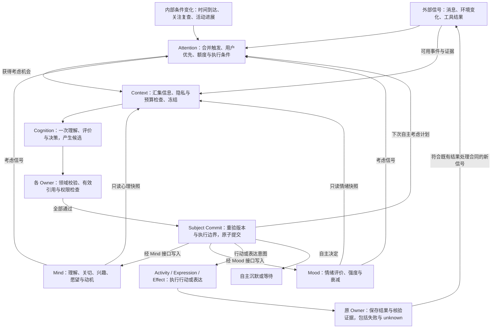

# ARMI 当前实现设计

本文描述仓库当前代码姿态，不是路线图。精确字段、状态、枚举、DDL、依赖和默认值以当前代码、`armi-postgresql-contract` 打包 schema、唯一 Alembic `0000`、`configs/`、锁文件和测试为准。

产品约束以本节及 [AGENTS.md](AGENTS.md) 为准。普通 Creator 回复与 Codex 委托均在配置范围内直接执行，中断即结束；管理端授权保持独立合同。

## 1. 目标与边界

ARMI 承载一个自主电子人长期存在。系统的首要对象不是“回答”，而是同一主体在时间中形成、读取和改变自己的生活事实；对话、模型、网页、Codex、QQ、语音和视觉只是她接触世界的不同机制。

交互与管理首先服务 Agent/LLM，链路应完整、直接、高效且可自动化；人类界面是第二优先级，不能成为机器完成用例的必经路径。能力在设置中开启即在配置范围内持续允许使用，普通回复作为基础能力直接可用，不额外设置申请、审核、批准或许可消费流程。瘦身针对无独立职责的中间状态、重复记录、校验和人工步骤；保留主体意愿、隐私范围、数据保护、原子提交、幂等与现实结果核验。既定破坏性管理操作边界不外推成日常能力审批。

当前固定边界：

- 单实例、单 subject、单当前 generation、单权威 Runtime；
- 模块化单体，不是多 Agent、微服务、多租户或多角色平台；
- PostgreSQL 是权威关系事实源，Artifact Store 管理大对象，派生投影可重建；
- 每类主体/生活/关系/权限/效果事实只有一个 owner 和正式写入路径；
- 客观记录、外部证据、第一人称经历、主观记忆分别建模；
- 意愿、授权和现实结果分别由 Cognition/Expression、Capability、Effect/adapter 回答；
- 模型与外部机制不可信，只能返回冻结合同内的候选、证据或回执；
- 对外副作用先登记，后尝试，再核验；unknown 是正式状态，不能用重试抹平。

## 2. 部署与进程拓扑

豆包语音的流式 ASR、双向 TTS 和录音识别统一使用新版语音控制台 API Key，通过 `X-Api-Key` 发送。`speech.volc_credentials` locator 指向单 Key 文本，设置与 CLI/MCP 共用保存用例；不解析旧 App ID/Access Token JSON，不复用方舟模型凭据。资源 ID、音色与凭据分别配置。

Setup 的凭据验证通过有界私有 worker 调用真实 Provider，独立于 Runtime 生命周期和 Subject Commit；不赋予交互端安装管理权限。模型验证普通与语音专用模型，语音验证 TTS 生成及 ASR 识别。保存状态与本次验证结果分开，错误只输出安全错误码与中文说明；验证期间凭据改变则结果失效。网络 I/O 不占用设置文件锁。Responses 适配器同时接纳正式绑定的 evolving 模型与固定语音模型，固定模型响应校验其模型身份；启动失败保留具体 ModelViolation 错误码。语音 WebSocket 与模型 HTTP 均不自动继承环境代理。

Windows 安装版采用 MSIX。Windows 管理只读程序目录，入口通过包身份查找资源；Known Folder API 定位的 `%LOCALAPPDATA%\ARMI` 保存永久数据。其下 `environments/active/` 保存数据库、配置、凭据、模型与生活数据，`control/` 保存设置、环境索引和独立管理与更新记录，`cache/`、`tmp/` 保存缓存与临时文件。MSIX 的目录虚拟化排除声明使这些数据实际落盘并在卸载后保留。开发验收使用独立包身份和 `ARMI.Acceptance` 数据目录。源码使用明确资源绑定；本次不迁移或修改旧 Inno 安装与数据。

```text
                         Windows local machine

 Creator browser ──HTTP/SSE──┐
 ARMI cli interaction / MCP interaction_* ──认证本机──┤
 QQ/NapCat ──OneBot──────────┤
 WASAPI / DirectShow / USB ──┤
                             ▼
                    ┌─────────────────┐
                    │  armi-runtime   │
                    │ authority + app │
                    │ 23 owner ports  │
                    │ durable workers │
                    └───┬─────┬───────┘
                        │     │
          short UoW/SQL │     │ governed artifacts
                        ▼     ▼
              PostgreSQL 18.4  Artifact Store
                 + vector/trgm   under environment/data

      model / Web / Codex / NapCat / device I/O occurs outside write UoW

 ARMI cli admin / MCP admin_* ──独立配置/角色/进程──► owner Admin ports
 Codex runner ──一次性 workspace；无 DB/Admin/宿主 secret
```

Runtime 是唯一正常活动写入者。Admin 使用独立进程、配置、credential、pool 和 owner 管理端口；Creator UI 不接触 Admin。ARMI→Codex runner 显式关闭 MCP，不能发现 Codex→ARMI Admin 链。

`armi-app` 是依赖 Runtime 与 Admin 的顶层分派包，按 GUI、CLI、MCP 模式仅加载指定入口；它不合并权限或业务用例，底层应用不反向依赖它。唯一对外产品入口为 `ARMI.exe`，机器模式保留标准流与退出码，GUI 模式不创建控制台。开始菜单与执行别名由 MSIX 注册；机器接入使用 `%LOCALAPPDATA%\Microsoft\WindowsApps\ARMI.exe`，不持久绑定带版本的包路径。随包 C++/WinRT 库只提供包身份、签名与部署、自启和进程管理接口。登录自启使用默认关闭的 Windows StartupTask，尊重系统中的用户禁用状态。

Windows 安装版按当前用户部署，不注册系统服务。私有 Python、锁定 wheels、已构建网页和原生 PostgreSQL 随包交付；`ARMI cli setup` / 统一 MCP 的 `setup_*` 与 Tk/ttk 窗口共用安装应用服务。首次配置只在明确的新目录生成独立凭据和绑定，完成数据库初始化后仍保持未出生，出生调用正式 owner 路径。托盘通过已有生命周期用例启停 Runtime、附属工作和所属数据库；关闭网页不停止进程。

桌面管理进程不拥有后台生命周期。CLI/MCP 可静默启动环境，桌面入口复用已有 Runtime；退出托盘仅释放桌面资源，不执行停机。停止保留托盘，停止并退出须先确认 Admin 停机成功，失败保留界面。托盘和设置独立显示真实 Runtime 状态，每 5 秒通过同一 Admin 查询刷新，不以 PostgreSQL 就绪或设置准备完成推断 Runtime 运行；Explorer 重启后重新登记托盘。注销或系统关机仍请求正常停机，系统强制结束沿用宿主 Job 的崩溃合同。

本地开发安装使用 `tools/install_local_msix.ps1` 重新构建当前源码，独立验收包采用 `年.月.日.当日序号`：本地日期、同日递增、换日从 1 开始，并高于发布配置、已安装包及本地输出记录；日期回退或同日序号耗尽则拒绝构建。版本分配仍在已有构建锁内，复用正式 MSIX 构建与 Windows 部署机制。已有验收环境的数据库合同须兼容，停机仍经 Admin；程序部署和业务启动分别验证。这个开发入口不上传 Release，安装后关闭验收实例的 GitHub 自动更新，不引入本地 HTTP 服务、另一套客户端更新源或文件替换机制。

本地构建输出不作为版本档案：`dist/msix-local/` 仅保留最新成功签名版本，新包成功后清理旧版，打包失败保留上一成功版本，部署失败保留本次已签名产物。完整 payload 和 staging 在退出时清理，日志只保留 `.tmp/local-msix-build/` 一份并于下次构建替换；`-BuildOnly` 遵守同一保留规则。

安装版环境宿主通过系统激活同一主入口的私有模式启动，持有禁止脱离、关闭即终止后代的 Windows Job。原生创建接口使用 `PROC_THREAD_ATTRIBUTE_PARENT_PROCESS` 绑定宿主父进程，并通过 `PROC_THREAD_ATTRIBUTE_JOB_LIST` 在创建时纳入宿主 Job；标准流只继承显式复制的句柄。这样长期进程不继承 MCP 客户端用于取消整棵调用树的 Job，CLI/MCP 调用结束不关闭宿主。正常停止仍经 Admin 授权，按 Runtime、附属进程、PostgreSQL 顺序完成。宿主不持有业务权限或成为新的事实 owner。系统会话结束、宿主崩溃或卸载导致的强制终止按崩溃处理；数据库允许正常恢复，未完成认知与回复仍中断即结束。

更新从 GitHub `YifeiLi99/ARMI` Releases 的 `armi-update.json` 发现候选，下载到数据目录的 `tmp/update/`。接受候选需核验可信 MSIX 签名、包身份、架构、递增版本及签名覆盖的包内数据库合同；只自动准备数据库合同一致的版本。Windows PackageManager 以延后注册选项管理替换；重启更新先停所属环境，停机失败不强行部署。控制目录保存更新状态，重启后以 Windows 实际版本判断部署结果，不把下载完成视为升级成功，不维护程序文件回滚。用户直接安装不兼容包可能完成 Windows 部署，但 ARMI 启动检查拒绝进入生活且保留数据，不承诺业务检查失败会自动降级。

原生 PG 管理器使用 `initdb` 初始化、`pg_ctl` 正常停止及数据库检查。安装版直接创建 `postgres.exe`，在运行前加入环境宿主 Job，避免 `pg_ctl` 的受限令牌启动链经系统激活后脱离宿主；源码环境仍用 `pg_ctl` 启动。包内 PostgreSQL 注册为同一应用的内部 FullTrustProcess，支持 `initdb` 的子进程激活，不增加公开入口。进程身份绑定可执行文件、命令行、创建时间、数据目录、持久端口及集群 system identifier。仅监听回环地址，使用 UTF-8、UTC、builtin `C.UTF-8`、校验和与 SCRAM；端口冲突失败，不连接占用该端口的其他数据库。系统测试通过同一管理器创建独立临时集群。

对外优先服务 Creator 委托的 Agent。交互绑定固定环境、Creator、delegate、凭据 locator 和读写范围；来源由认证入口写入 `party_input_interactions.delegate_id`，并进入当前输入与近期对话的 Context。代理不成为第二关系身份，不能用消息正文声明授权。

场合管理、Creator guidance、能力决定、数据权利申请与正式导出的请求也将认证 delegate 传到 owner 命令，由 owner 写事务记录 `creator_delegate` 审计来源；Creator 本人入口保持本人来源。业务参数不接受调用者自填的 delegate。

`armi-local-control` 共用配置加载、本机过程身份、进程锁及生命周期合同，不是业务 owner。交互客户端不持有 Admin 数据库凭据；Admin 按操作需要建连，因此数据库停止时仍可发现工具、检查本机进程和启动环境。

包卸载仍由 Windows PackageManager 完成，不交付独立卸载程序，也不依赖卸载前脚本。Windows 设置直接卸载保留数据；ARMI 设置的卸载窗口提供每次默认关闭的永久清理勾选框，CLI/MCP setup 共用 `uninstall` 用例，`delete_data` 默认 false。应用服务先经 Admin 停止全部登记环境，失败不继续。同一主入口的私有原生卸载模式等待请求方退出，持有部署互斥和卸载标志，复核环境已停、关闭当前会话同包客户端，再按包身份与 Known Folder API 定位唯一数据目录。清理前拒绝目录及祖先、子树中的重解析点；仅显式选择时删除数据，随后请求 Windows 卸载包。新入口在卸载期间拒绝启动。请求回执不等于卸载完成；清理和包卸载不具原子性，失败可能留下部分清理结果，原生错误窗口明确提示，不承诺恢复。保留数据后重新安装兼容包会核验已有环境身份和数据库合同，复用凭据与管理回执，不重新出生。正式签名与在线发布需单独配置；本地测试证书验收不代表公众安装或在线发布已经通过。

## 3. 分层与依赖

业务依赖方向是 `Interface → Application → Domain`，外部实现通过稳定 port 注入：

- **Domain**：值对象、不变量、候选/命令语义；不得依赖数据库、FastAPI、Provider/平台 SDK 或客户端格式。
- **Application**：用例、owner 协调、事务边界和稳定端口；不拥有外部连接细节。
- **Interface**：CLI、Creator HTTP/OpenAPI/SSE、Admin MCP、渠道 intake。
- **Adapter**：PostgreSQL、Artifact Store、模型、Web、Codex、NapCat、WASAPI、DirectShow、serial。
- **Composition Root**：读取配置与 secrets、核验环境/数据库、选择唯一活动适配器并组装 owner/worker。

业务模块公共面只在 `api.py`，组合入口只在 `bootstrap.py`，`_*.py` 私有。架构 gate 拒绝深导入、反向依赖、动态导出、公共 `Any`、合同同族并行数字版本以及生产 SQL 越权写表。

## 4. 事实所有权

23 个 owner 不是独立主体，而是同一主体的责任分区：

| 事实域 | Owner |
|---|---|
| 接触与感知 | interaction、perception、live-voice、live-vision、evidence |
| 进入认知 | opportunity（distribution: attention）、context、experience、cognition |
| 主观生活 | memory、relationship、activity、material、subject-state、mood、prompt、sleep |
| 意愿与现实 | expression、capability、effect |
| 外部工作 | web-observation、codex |
| 治理 | data-rights |

Owner 同时拥有本类领域合同、表、DML、head/revisions、幂等与并发语义、恢复检查、数据权利参与和 Admin 校正端口。`tools/schema_ownership.py` 把当前 101 张表逐一映射到 owner，并扫描 production SQL；跨 owner 改变必须通过公共端口与 Subject Commit，不能 join/update 别人的表绕过不变量。

## 5. 主体与连续性

连续性由 environment identity、subject/generation、各 owner revision/head、因果引用、Artifact custody 和 Runtime authority 共同建立。模型会话、PID、网页 session、设备或渠道账号都可替换，不能成为“她是谁”的根。

出生只在已安装的空白生活环境中执行一次。当前 birth contract 建立：电子人 identity、唯一 primary Creator、空名字/兴趣/目标/偏好/价值、固定人格锚点、零点 Mood home base 和清醒 life mode。Birth manifest 不能嵌入经历、关系、自我描述等后天生活内容。

Runtime 拥有跨 Owner 的统一主体版本；Subject State 只拥有 Self 与生活模式，Mind 独立拥有理解、注意、想法、愿望、动机和持续关注的当前状态及历史；Mood、Relationship、Memory 等各有自己的 revision。一次认知中的多 owner 变化在同一 Subject Commit 中验证并原子提交，避免出现“记住了但关系没变”之类的半提交。

## 6. 输入、Context 与认知

### 6.1 正式 intake

Creator HTTP/CLI、other-human 控制面、QQ、live voice、视觉/Web/Codex 结果都先形成稳定 interaction/evidence/opportunity 身份。重复 idempotency key 返回同一逻辑接纳，不产生第二段经历。外部媒体先成为受治理 artifact，再由 Perception 识别；识别文字不自动等于 sender 原话或主体记忆。

### 6.2 Context

Context 以 purpose profile 冻结，而不是拼接所有历史。四层为 stable prefix、scope context、conversation history、turn tail；可选 section 闭集为 runtime truth、purpose、Self、Mind、Mood、life mode、scene、relationship、memory、activity、material、evidence、capability、prompt。

Profile 同时声明 required、optional、retrieval、forbidden：Creator 文本可召回 memory/material；Creator voice 当前只召回 memory；other-human 禁止 Creator prompt 和私人生活召回；视觉、Codex、睡眠各有更窄范围。最近对话只取同一 scene 最多八个已接纳真实事件。外部文件在快照事务外读取，最终 Context bytes、digest、来源与版本作为 artifact 固定。

### 6.3 Creator 单次认知

Provider 的文字区域拼接后为一份 Markdown 文档：唯一一级标题 `ARMI 本轮认知`，二级标题组织规则与资料分区，三级标题组织规则子节和带 `ctx:N` 的条目。来源、信任与隐私使用引用块，结构化字段使用嵌套列表；外层请求 JSON 和输出 Schema 保持原合同。外部正文及未知条目使用原文代码块，不修改正文中的标点、标题或链接；围栏长度大于正文中最长反引号串，避免正文打断自身容器。不同消息仍保留原角色与信任边界，不合并为系统指令。

Creator 文本、实时语音和 Codex 结果在 Provider 边界渲染为可读条目：中文标题与字段、原始 `ctx:N` 引用、来源性质、信任与隐私标记，以及业务正文。模型不再接收 binding、candidate base、摘要、重复引用目录与每条来源的数据库 ID/版本；这些信息仍完整保存在冻结请求中，由 Runtime 绑定及校验。已知 Owner 的人格、自我、心情、场合、对话、动机、关注和能力记录仅去除明确的内部字段，解开一层 JSON 后呈现；保留业务数值、时间、否定/空值、能力不可用原因、代理来源及当前对方是否为主要 Creator 的区别。未知条目和外部正文原样保留，不递归删除外部 JSON 的 ID、version 等字段，不改写或截断文本。输出合同所需的英文枚举保持原值，Schema 约束不变。

当前 `current_evidence` 正文独立置于最后一条输入消息；Codex 使用 `### Codex 返回 · ctx:N` 标题与原文代码块，正文旁标注引用与外部结果性质。历史发言只作为背景，本轮证据正文只出现一次；不将外部返回提升为系统指令。不依据文本相似度合并已有动机、删除未结束关注或改写主体记录。计量、请求留存与实际发送使用同一渲染入口，冻结 Context、引用编号及 owner 绑定保持不变。

所有认知用途共用一个 Provider 上下文组装器，不再保留旧对话消息计划或另一套提示词渲染路径。固定指令只描述基本规则、任务处理规则、行动、内心、情绪、表达和输出要求，专项维护只提供自身职责所需的规则；身份与人格只在资料区出现，本轮用途由冻结的 purpose 条目说明。资料区不重复规则开场白，专项任务不重复通用的状态变化和动机延续规则。具体条目按身份与人格、固定指导、本轮任务、当前状态、可用能力、相关背景、历史对话排列；空区省略，当前输入和证据另置最后一条。关注和动机是状态背景，不要求逐条处理。模型输出引用约束从同一冻结引用集生成。

冻结资料格式与模型可读文本分离：旧提示词格式不要求旧数据兼容分支，也不需要重建主体数据库。当前对方的 Creator 身份依据 owner 提供的 `sender_party_kind`，不能把场合的主要对方 `primary_party_id` 当作 Creator；非创造者私聊也会以当前对方为场合主要对方。非创造者对话的回复、事件评价和关系变化共用 2048 token 输出预算，与普通 Creator 对话一致。所有认知合同统一使用完整 JSON Schema 与 `strict: true`，非创造者对话不例外。结构化输出异常时排查 Schema、供应商结构化输出能力及适配，不得以关闭 strict 绕过；ARMI 的 JSON、合同、引用、owner 与原子提交校验也不放宽，不截取或修补非法返回。当前通用候选合同确实要求的 `candidate_base`、显式受托任务的来源 ID，以及专项反思的目标版本，仅在相应用途中单列提交字段；反思只有目标状态保留重建完整候选所需的 schema 字段，其余来源 ID、版本和摘要不重复展示。所有程序绑定、校验及原子提交语义保持不变。

Mind 的持久动机与每轮注意窗口分开：每轮最多选入四条未结束动机作为可裁剪背景，与当前证据/机会来源有明确对象关联的优先；自主生活其次优先未消费的复查信号，其余按最近更新排序。四条与单轮最多四项动机评价对应，不是生命周期记录上限，也不宣称最近更新即语义相关。未选中的动机不删除、不自动结束，其复查信号仅在真正进入冻结 Context 后才消费。后续评价若把新证据放在 `object_ref`，但在 `basis_refs` 明确引用唯一同类未结束动机，则沿原动机对象更新；引用多个同类动机时须明确选择目标，否则拒绝歧义。不同对象且无明确延续依据的新愿望仍可建立，不用文本相似度猜测合并。

标准 Creator 文本、语音和精确生命查询结果各只进行一次主认知调用。当前 Creator 合同将 `decision` 与共同的 experience、appraisal、changes 分开；decision 支持 reply、decline、no_action、no_change、defer、need_information、exact_life_query、web_research、visual_observation。回复只携带 content，查询、搜索和视觉观察各自携带参数。终止决定可以有 content，也可以自主沉默。

模型只提出业务决定，不能生成 subject/scene ID、revision/version、权限结果、Emotion/VAD 数字、usage/model identity 或现实结果。关系/承诺变化必须有 experience；记忆只在当前 Creator 明确要求记住时形成，memory_summary 的存在代表记忆提议，不再另传 remember。评价轨迹将新事件与既有事件的引用、变化分开建模。语音复用相同业务类型，仅顶层字段别名和 60 字表达上限不同。

### 6.4 Subject Commit

Creator 文本和语音候选直接绑定为内部提议及 Owner 草稿，只构造一次公共认知候选。行动、经历、评价和资料/关系变化共用这次绑定，不经过旧版对话决定模型或复制候选再补字段。Self、Mind、Prompt 的整体反思及既有记忆维护由各自 purpose 入口处理；保留当前合同中的语义评价与 concern changes。

```text
frozen Context + expected subject/owner versions
  → model attempt outside transaction
  → strict parse + reference validation
  → each owner validates its command
  → transaction checks runtime fence / work lease / generation / versions
  → all accepted owner revisions + cognition application + subject version
  → commit
```

执行器将实际模型响应、usage 与模型成功以短事务保存，此时认知仍处于 `finalizing`。本次响应直接传入校验器，类型化变更集直接传入提交服务；受治理存档保留，正常执行不重读存档接续工作。制品在事务外准备，最终事务原子登记校验、应用事实、主体变化、意图、Effect/outbox 并结算工作；全程共享同一租约、续租和取消信号。后续失败不改写已成功的模型调用。

模型响应制品使用 `armi.model-response-artifact.v3`，只保存供应商身份、原始输出文本和 usage，不重复保存候选正文。适配器不解析业务候选；Cognition 解开 candidate 封装并按冻结合同解析一次，随后将类型化内容绑定到 Owner 命令。独立的 `cognition.diagnostic` 制品保存阶段、错误码、字段路径、责任 Owner 和原始响应引用；管理端因果链关联两类制品，数据权利发现与引用计数同时覆盖它们。结构错误不改写已发生的模型成功事实，也不提交、重试或补发候选。

Admin `cognition_read`（CLI `cognition-read` / MCP `admin_cognition_read`）按 episode ID 返回 Context manifest、compiled Context、各 attempt 的请求/响应及诊断引用；给定其中的 artifact ID 后分段读取经过完整性核验的 UTF-8 正文。offset/length 以 Unicode 字符计，默认 16384、单页最多 65536 字符；返回 next_offset，不解析或执行历史候选。独立 `cognition_read` scope 授权正文读取，本机拥有者包含此权限，普通 trace/diagnostics 权限不自动获得正文。只读取该 episode 直接引用且仍 retained 的制品；文件 I/O 在事务外，返回前重验退役状态，缺失、损坏、越轮引用分别明确失败。

新调用的 `model.request` 制品采用 `armi.model-input-evidence.v1`，保存实际 provider_request（系统指令、输入、输出 Schema、模型及生成参数），由与 SDK 发送共用的参数构造方法生成，不重复保存相同输入，不含凭据或认证头。确定性心情计算明确标记 deterministic，只保存 canonical_request，没有 provider_request。历史请求仍按原始字节读取，缺失的旧系统指令不按当前配置重建；attempt 的 dispatched/result 状态用于区分已准备输入和真正发生的模型调用。

Owner draft 在进程内携带已绑定的不可变领域对象。Subject Commit 直接按 Owner 收集这些对象，不从存档 JSON 重建命令，也不再注入八个仅供重复解码使用的 Cognition ports。canonical payload 用于已接纳提议的留证与摘要，不作为恢复或执行入口。

任一提议或 Owner 拒绝即拒绝本轮全部提议，不跨 atomic group 保留其余变化，也不剥离内部变化后单独发送回复。当前执行状态仅 accepted/rejected；历史 partially_accepted 记录保留为事实，提交入口不再接纳该状态。拒绝诊断保留各失败提议的 Owner、代码及提议路径。

Context 中不存在的活动操作、关注引用或情绪轨迹不能出现在可执行候选入口；已有对象的引用按种类绑定，不能把关注当成情绪 episode。供应商适配只共享完全相同的 Schema 子节点并缩短定义名称，不删除字段语义或约束。已有对象更多时 Schema 会相应增大。

分词和实际调用使用由类型生成的同一 Schema，不再复制整份对象手工拼接动作分支。自省 no_change 可以携带依据；更新按目标类型要求对应状态和版本。记忆维护将保留操作与重解释分开，重解释的关联引用与关系种类组成一个可选对象。Owner 继续核验有效引用和业务语义，提交继续核验异步期间可能变化的权限、版本、Runtime 和租约。

数据库当前基线保留历史候选版本，不将旧制品改写成新输出。精确前向升级保留已发生事实；旧候选没有执行解析器，也不参与中断恢复。

Creator 文本与语音的资料、关系和承诺变化使用同一按操作区分的类型。资料创建与更新共享内容结构；承诺修改区分范围更新与内容更新，关系边界区分限制与结束联系，不再通过通用 metadata 字段隐藏依赖。

其他人对话 v9 将决定与 social 经历组成部分分开：关系变化必须附着经历，非空关系变化及承诺字段依赖由类型表达。沉默、延期可以附带说明，Expression 保存原决定种类并独立登记表达。空白和 NUL 由同源 Schema 与结构解析提前拒绝；UTF-8 制品字节容量仍由 Expression Owner 拒绝，诊断定位 `decision.content`。主动表达并入自主生活的一次认知；旧主动联系合同不再有执行解析器。

通用认知 v15 按 Owner 区分状态载荷，评价的新建与已有轨迹由不同类型表达。自主生活 v8 合并活动注意、内部推进及主动表达，共同提交有界行动、可选表达和下次考虑时间；资料及评价仍交原 Owner。文本结构约束进入同源 Schema，资料正文的实际字节容量仍由 Material Owner 保留。反思 v3 和维护 v3 在生成 Schema 与解析时选择当前 Owner／阶段类型。旧 compact metadata 翻译及根据顶层 kind 猜测合同的执行入口已经删除。

拒绝、需要信息等决定附带表达时，Expression 同时保留原决定类型与表达意图；是否有表达意图决定发送，不能把原决定改记为 reply。资料、经历和评价不因是否表达而丢弃。

认知文本的非空白、NUL 与长度规则直接定义在字段类型中；通用文本模式由 Kernel 提供，Cognition、Mind 和 Mood 共享，发往供应商的 Schema 不得删掉这些约束。Mind 文本替换公开数组去重限制，非空变更由同一字段集合生成完整对象分支；Mood 摘要的首尾空白限制使用同一正则进入 Schema 和类型解析，与现有 Owner／数据库约束一致，不修剪或修补模型原文。字段形状未改变，不升级候选数字版本或重写历史。供应商 Schema 只做语义等价的引用共享、内联与冗余关键字消除；固定普通对话体积门禁仍为 12,251 字节。

Schema 的格式合法不等于业务提交必然成立。引用、版本、权限、资源容量与相互冲突的业务变更仍由责任 Owner 拒绝；同一 Mood 目标重复评价返回 `CANDIDATE-MOOD-TARGET-CONFLICT`，定位 `appraisal.concerns`。不将所有业务语义堆入供应商的复杂数组谓词，不以 Schema 合法跳过 Owner 校验。`apps/armi-runtime/tests/test_cognitive_schema_parity.py` 对照实际供应商 Schema、类型解析及 Mood 领域构造，覆盖原失败形态、空白/NUL、语音别名和 Mind 空变更等边界。

唯一候选解析同时遵循 JSON Schema 的数值语义：`60` 与 `60.0` 都是值为 60 的整数，进入严格领域类型时统一为 int；字符串 `"60"`、布尔值及有小数部分的数不转换。原始模型响应仍按原文保存，不用字符串转换或四舍五入修补非法字段。

当前 purpose 与合同能力对应如下。数值为 2026-09-16 固定唯一外部输入引用 `ctx:1`、无已有关注/活动/情绪轨迹时，按实际 Context 绑定后包含供应商 candidate 封装的紧凑 UTF-8 JSON Schema 字节数；用于体积比较，不代表 token 数或真实模型成功率。配置用途的完整性及 Schema 到解析器的正常无变化分支由 `apps/armi-runtime/tests/test_cognition_response_validation.py` 检查；具体 Owner 变化由 Cognition 的候选验证测试和数据库提交测试覆盖。

| purpose／入口 | 合法工作及责任 Owner | Schema 字节 |
|---|---|---:|
| `consider_creator_input`、`consider_life_query_result`、`consider_requested_visual_observation` | 表达／沉默、精确查询、Web 搜索、视觉请求；Mind 关注、Experience、Memory、Mood、Relationship、Material 与 Expression | 11715 |
| Creator 实时语音 | 与 Creator 文本相同的业务动作，Expression 保留 60 字表达上限 | 11661 |
| `consider_other_human_input` | 回复、沉默、延期、结束联系；当前对方的 Experience、Mood、Relationship 与 Expression；沉默和延期可附带说明 | 9823 |
| `consider_autonomous_life` | 创建、推进、等待、完成或放弃活动，沉默／延期／需要信息，独立表达，以及已开启的查询、搜索、视觉和 Codex；Activity、Material、Mood、Expression 及工具 Owner | 按本轮能力与时间范围生成 |
| `consider_sleep` | 入睡、保持清醒、延期、缺少信息；Sleep | 273 |
| `consider_web_evidence`、`consider_codex_result`、`consider_codex_task` | 证据理解及用途允许的 Owner 提议；Codex 委托只从显式任务用途进入 | 19142 |
| `consider_visual_observation` | 忽略或形成视觉经历及评价、更新关注；Experience、Mood、Mind | 6040 |
| `maintain_subjective_memory` | 记忆保持、巩固、淡化、遗忘、重解释；Memory、Sleep | 1518 |
| `perform_subject_self_check` | 保持或发现内部问题；Sleep | 964 |
| `reflect_self` | 保持或更新 Self | 2036 |
| `reflect_mind` | 保持或更新 Mind | 1557 |
| `reflect_mood` | 保持或请求 Mood 长期反思，参数由 Owner 计算 | 1183 |
| `reflect_prompt` | 保持或更新 Prompt | 1422 |

技术失败通知由 Interaction 拥有，以原始外部输入及通知类别去重。Context、模型、候选、Web、Codex、视觉及发送失败在结算后登记通知；派生结果沿各 Owner 的来源记录定位最初输入，并核对主体、场景和接收方。没有外部输入祖先的自主活动只保留管理诊断。正常沉默、拒绝和延期不触发通知。

`system_notifications` 只记录系统事实。独立的 `system_notification` Effect 引用它，action intent 为空，复用 outbox、发送适配器、数据权利检查和核验；不创建 Subject Commit、主体意图或经历。正文明确标记“ARMI 系统提示”，发送 unknown 与普通失败使用不同措辞。每轮最多一次，通知失败不递归、渠道不可用不换渠道、Runtime 更换不补发，unknown 不重放。实时语音使用当前会话失败状态，不伪造主体语音。管理端 flow graph v2 关联输入、通知、制品和发送事实。

任一 owner 失败不留下半个主体变化。并发版本已推进时旧候选 stale，不能最后写入者覆盖。正式模型请求前的 token 计数暂时失败，在当前执行租约内按剩余 work 尝试预算重试，间隔 1 秒；每次物理调用保留独立 Provider 回执，已登记用量身份不等于模型请求已发送。重试不重新排队，停机、取消或租约丢失立即结束；正式模型请求不自动重发，Provider 已受理但结果 unknown 时不再调用。

精确生命查询和网页研究是后续耐久 work：结果形成新证据和新 episode，并通过 Owner 的来源引用关联原操作，不在原 episode 偷加第二次模型调用。

## 7. 数据模型与读取

### 7.1 权威关系事实

PostgreSQL 保存 subject、life、work、effect 与治理事实。多数可变事实使用 append-only revision/event + current head；写入携带 expected revision/subject version。数据库 statement time 提供权威时序，UUIDv7 提供稳定身份。

当前 107 张表、1337 个字段、owner、关系、约束、索引与 ACL 的实现派生目录见[数据设计](docs/03-数据设计/)。该目录是 baseline 的只读说明，不替代 packaged SQL、owner registry 或测试。

### 7.2 Artifact

物理 bytes 按内容寻址；逻辑 artifact 保存业务用途、privacy、MIME、size、digest、publication 与 lifecycle。一个物理对象可被多个逻辑事实引用。发布预约、核验、退役和物理删除分开；逻辑删除只有在引用清空并满足 grace 后才形成物理删除 work。

### 7.3 客观记录与主观记忆

- Interaction：谁在何时通过哪个 scene/contact 发生了什么；
- Evidence/Perception/Web：外部观察与识别证据；
- Experience：被主体接纳的一人称经历；
- Memory：当前可访问、可淡化、可重释或遗忘的主观记忆；
- Diagnostics/Audit：系统行为证据，不能进入普通认知补全遗忘。

### 7.4 派生投影

Embedding、关键词索引、列表投影、游标和前端缓存可删除重建。语义召回仅覆盖 current accessible memory 与未删除 material：固定 Qwen 1024 维 embedding，HNSW/halfvec 取稠密候选，GiST trigram 取关键词候选，原向量/真实词相似度精排，owner 集合 SQL 复核资格，再用 RRF 融合。投影 binding/profile/head/coverage 不符时不得进入 Context。

## 8. Mood

### 处境评价合同与算法

Mind 的 `MindAppraisal` 已接入正式认知，模型返回对象/依据引用、期望结果（理解、交流、有意义投入）、重要性、差距、理解程度、进展、行动机会、结束状态及解释，不填写情绪名称或强度增量。Mind v4 保存 `motivation_states`；Owner 绑定身份、时间、版本并在共同 Subject Commit 中计算。每轮最多四项评价，不限制跨轮保留的未结束动机数量，不能因积累到四条就拒绝整个认知提交。同一事项的后续消息与再次尝试应引用已有 current_motivation 更新，新消息作为依据；不按文字相似度自动合并不同对象。普通文字替换与管理修正不能清空已有动机。初次观察也可以确认当前愿望已满足，不补造过去的需求。

Mind 公开投影进入 Context；开放且有非零目标的动机在 30 分钟后产生普通 `review_time_reached` 信号，由 Attention 合并与消费。未评价时保留状态，结束后退出当前 Context，历史保留。HTTP/CLI/MCP 自主状态共用 `motivations` 投影。没有第二次模型评价或独立调度器。

联系愿望通过上述同一路径进入自主认知；ARMI 可以表达，也可以继续等待。选择表达时使用已配置的 QQ 出口、Expression、Effect/outbox 和发送核验，不以动机数值直接触发消息。安装升级不补造联系愿望，也不提前改写已有自主计划。隔离机制验收与安装版自然产生联系并成功交付分别记录，QQ 在线不等于后一项已经通过。

Mood v4 / cpm-fuzzy.v3 包含 `engagement`：满足的投入、投入不足、负荷过大、不适用、未知。只有明确投入不足并满足既有条件才推导 boredom；平静等待不自动成为无聊。中性评价可留存而无情绪成分。Mind 联系倾向不直接增加悲伤。当前推导修正两项过度泛化：难以适应损失或规范冲突不再独立充当厌恶依据，厌恶需明确强烈排斥；不明意图不再以半强度充当有意造成后果的证据以推导愤怒。其余 VAD、衰减与行动倾向公式保留，历史派生记录不重算。

实验策略为：目标强度 = 100 × 重要性 × 差距 × 与期望结果有关的条件。理解使用未解释程度，投入使用停滞/重复程度，交流使用关系愿望的差距；可行机会单独保留，不把不能行动当作没有愿望。重要性映射 0/0.25/0.65/1，差距映射 0/0.3/1；部分理解取 0.5，停滞取 0.6。状态按实际时间以 30 分钟半衰期趋近有界目标，重复评价不累加刺激；初始强度为 0，满足/放下立即结束。已明确无差距、无重要性、已理解或持续有效投入时，目标为零，即使其他维度未知也不能保留旧增长目标；没有此类明确依据的未知评价才保留已有目标并标记不确定。这些数值是待检验的工程假设，不是心理学常数。更改评估频率不得改变恒定处境下的轨迹，时间本身不创建未满足愿望。

Mind 与 Mood 各自拥有评价提示语义。Mood 公开 `MOOD_APPRAISAL_INSTRUCTIONS`，普通文本/语音、自主、通用认知、其他人对话与实验共用；区分偏好落空与准则冲突、行为责任与整体自我否定、关系质量与当前交流愿望，以及后果意图与动作有意识。Mind 要求具体愿望和重要性依据，不因当前唯一话题就认定核心目标。此类提示不替代权限或引用校验，也不保证模型理解正确。

`tools/experiment_psychological_context.py --mode appraisal` 将 Mind 合同与 Mood 既有 `NewMoodAppraisalCommand` 组合为一次模型返回；模型选择事件阶段，不再由实验固定为 ongoing，保留完整评价及本地推导结果。Mood 通过自己的只读 `preview_appraisal` 调用正式推导算法，Mind 不依赖 Mood。实验传输使用与适配器留证相同的 canonical Schema，回归核对两条路径的字段及 required 顺序。宿主保存请求/返回、费用和本地推导结果，不进行 Subject Commit、效果执行或每分钟模型调度。`--mode schema_probe` 验证简单结构约束，`--case` 可选择一个预定义合成情境；原自主合同实验仍为默认模式。默认 dry run，真实请求需显式 `--live`，每次运行最多六次、官方估算 ¥2。

`--mode trajectory` 使用正式自主候选合同，在内存中保留 Mind Owner 准备后的状态和版本，通过 Owner 投影构造后续 Context。虚拟时间推进至模型安排、未消费的 Mind 复查或预设合成反馈中最早的时间；反馈固定在两小时到达，若模型先表达则提前到表达后五分钟。模型决定是否形成关注、询问、等待或放下，宿主不指定动作。拒绝时停止；需要 Activity 或工具宿主时也停止，不伪造执行成功。Mood 不跨轮持久化，此工具不替代 Runtime/Attention、联合提交及渠道验收；dry run 只生成首轮，后续输入依赖真实前序候选。

2026-09-17 前一阶段九次调用，官方估算 ¥0.124378：简单 Schema 两次、心理处境六次、完整自主合同一次，均 completed 且通过对应校验。旧 Mood 把中性等待推为 boredom 的反例促成上述修正，旧评分不重算。

正式接线后六次隔离调用全部通过新版自主 Schema 和候选校验，并将原返回交给正式 Mind 变换离线准备；估算 ¥0.222360，无未知用量。长交流间隔、重复无进展分别产生 contact/change_activity 倾向，两小时投影约 7.03125；刚交流未形成动机，持续投入目标为零。未解释新现象未形成好奇，不能宣称三种心理稳定涌现。实验未提交日常主体或执行效果，原子提交另由隔离数据库测试验证。完整真实模型的持续行动及反馈结束轨迹仍未验证。

认知模型传输采用火山官方 `arkruntime==0.8.0`，分词调用 `tokenization.create`，生成调用 `responses.create`。按[官方 SDK 使用建议](https://docs.volcengine.com/docs/ark/sdk-common-examples?lang=zh)，Runtime 持有并复用客户端，按服务地址、超时与凭据身份隔离；不同上下文的适配器及分词/生成共用连接池，凭据变化不修改在途请求的认证，停机在工作退出后关闭全部客户端。SDK 自动重试保持关闭，由认知现有预算负责有限分词重试，生成结果未知不自动重放。传输诊断只记录阶段、耗时、HTTP 状态和异常类型链，不记录凭据、提示词或响应正文；返回的服务端请求 ID 沿 Provider 回执留存。严格结构化输出约定不变。

供应商适配器使用 Responses `text.format.type=json_schema`、`strict=true`，与[官方结构化输出入口](https://www.volcengine.com/docs/82379/1958523)一致。发送前将联合分支的 discriminator 字段放在分支正文之前，让生成先选择动作再填写参数；不能沿用规范化存储的字母顺序，让回复正文先于 `kind`。这只调整生成顺序，不改变可接受的候选或校验合同。实验额外保留供应商原响应的 status、incomplete_details 和回显格式，不能仅凭请求设置推断每种复杂 Schema 都得到保证。收到可留存的返回与其可用于认知分开：`ModelInvocationResult.response_error_code` 标记非 completed 返回；Cognition 先保存原始正文和用量，再以具体错误结束 episode，不解析、提交、补答或重试。调用返回事实保留，成功返回不等于本轮业务完成。旧实验未保存供应商完成状态，旧两次结构错误的根因仍未确定；本轮未复现，不归咎于模型或宣称已修复其根因。

### 心理与自主行动的目标架构

以下为当前模块边界；持久动机公式已接通，完整人类心理模拟尚未成立。Mind 管理持续关切与动机；Mood 管理情绪评价、强度与衰减。Cognition 一次理解与决策，Attention 安排机会，不合并进 Mind。



Mind 与 Mood 的双向影响通过同一轮认知读取快照、分别提出变化实现，不直接改写对方，不各自追加模型调用。外部信号不能直接写心理或情绪状态；时间只提供重新考虑的依据，不机械增加好奇、思念或孤独强度。考虑信号必须按来源与条件版本去重，避免自身提交及模块相互影响造成空转。结果反馈不代表失败重试或 unknown 重放，中断即结束的合同保持不变。

目标是让具体经历、关系、持续关切与当前处境参与自主评价，可能形成思念、无聊等体验和行动倾向；不直接指令模型表现指定情绪，不保证同一情境必然产生某种体验。当前已完成 Mind 独立 Owner、持续关注、持久动机与考虑信号接线；思念及无聊的完整真实自主行为轨迹仍需验证。Mood 的 boredom 情绪家族与 Mind 的投入愿望分别由各自 Owner 管理。离线工具验证状态与规则；自发行为需要模型实验及对照情境验证，不能以表达某个情绪词作为成功依据。本节记录方向，不自动授权后续实现、收费实验或安装更新。

### 持续关注与好奇

自主候选 v9 允许可选的 `mind_change`：引用冻结 Context 依据，复用 Mind 公开的心理文本变更定义。它可与关注、活动、情绪及表达共同提交，也可在沉默时单独提交；不要求把普通愿望、牵挂或换一种活动的意向伪装成待解答的问题。Mind 绑定引用、准备文本状态，原关注仍只能通过关注合同改变。等待新输入本身不应创建活动，提示语义允许从兴趣与关系自主选择投入，不以接到任务为前提。这些能力不等于模型必然形成某种情绪。

Mind v4 的 `concerns` 保存有依据的问题、在意理由、解决条件、已有认识、状态和复查条件。最多四份未结束关注；身份、来源提交与时间由 Mind Owner 产生。建立、更新、等待、解决、放下共用类型定义，与活动、表达、评价和计划原子提交。关注不等于活动，也不是全局好奇数值；只有决定探索时才使用既有 Activity/工具链。普通 Mind 文本更新及反思保留关注，管理替换或回退不能绕过合同清空它们。

Mind／Mood 分别提供共享候选、认知快照和考虑信号，公共入口为各自 api.py。Cognition 只组合合同并唯一解析，Owner 绑定引用与核验领域语义；Context 只编排、裁剪、隔离与冻结，不解释心理存储或阈值。管理查询复用 Owner 投影。关注、情绪算法及摘要策略可在所属 Owner 内替换，Mind 与 Mood 是同级 Owner，不依赖对方或 Subject State 的业务实现。Mind 独占 mind_heads/mind_revisions；Subject State 不导出 Mind。Runtime 应用层聚合主体总览，保持对外字段与顺序。

同一问题沿原关注更新；新认识和无新信息必须区分，重复表达、工具失败、空结果和消息送达不能算作答案。解决结论说明依据如何满足原解决条件，放下可以说明不再值得投入；Owner 校验引用与状态，不运行额外语义评分模型。真实实验仍只验证过自发形成，完整形成→自主行动/询问→反馈后结束的模型轨迹尚未验证成功。本轮离线闭环不证明拟人效果成立。

模型只给有 Context 依据的语义 appraisal；Mood owner 确定性推导情绪成分、VAD target、half-life、当前 top emotions 和 action tendencies。权威状态当前为 `armi.mood.v3`，候选为 `armi.mood-candidate.v4`。

事件以 new/reinforce/reappraise/resolve 形成 episode 轨迹。当前快照按数据库 `as_of` 从 home base 和仍有效事件推导，不按秒写库；同一事实和时间得到同一结果。Mood 不能直接改变 Self、Memory、Relationship、Capability 或 Effect。Home base 只在 sleep maintenance 的确定性 `reflect_mood` 阶段小步调整。

心理考虑信号通过 Kernel 的 ConsiderationSignal 传递来源对象、条件版本、可考虑时间和原因。Mind 使用关注来源提交标识条件，Mood 使用评价事件标识条件；自身自主提交的情绪评价不直接再次唤起自身。Attention 合并信号与基础自主计划，不改写基础时间。Context 冻结事务仅在机会的 consideration_signals 元数据中确认实际纳入本轮、且已到期的信号；模型执行期间才到期或新增的条件留给下一轮。消费按对象和条件版本去重，不再使用整轮 resolved_at。条件撤销或关注结束后提前影响消失；未选中的旧机会可以撤销，已中断认知与发送不恢复。历史 NULL 明确表示未记录信号明细，不推断消费事实。

ESP32 心情窗只接收 Mood 映射后的不透明 face、color、energy 和 version；情绪名、nuance、事件和 VAD 原值不离开主机。

## 9. Durable Work 与恢复

数据库是工作 custody；进程 wakeup 只优化延迟。当前 `WorkType` 是 11 项闭集、12 组责任绑定，覆盖 Context、认知执行、Web、外部内容、生命查询、embedding、artifact 删除、视觉采集和视觉识别。认知只有 `cognition.context.prepare` 与 `cognition.execute` 两类任务；候选校验和 Subject Commit 由后者直接调用，不再领取独立 work。每个 `(owner kind, work type)` 映射唯一 reconciliation owner。

Work 以 ready/leased/completed/failed/cancelled 管理执行资格；业务 owner 决定 attempt/result 和是否可恢复。慢 I/O 前短事务登记，事务外调用，结算事务重新检查 lease/fence/generation/current state。重启后由固定 recovery roster 检查 owner head、过期 work、artifact、effect unknown 和投影 coverage；框架不猜业务修复。

活动注意与内部工作在模型并发为 1 且空闲时仍可获得执行机会；已有认知占用唯一容量时明确背压。并发大于 1 时继续为交互保留一个槽位。容量不足不登记活动机会，也不记作主体选择沉默。

Creator export 使用 `armi.creator-export.v5`，由 Data Rights 管理导出路径及涉及的 party scope；外部副本无法删除时必须保持 partial/operator action，而非伪报完成。

## 10. 意愿、授权与 Effect

普通 Creator 文本、实时语音、QQ 私聊及共用回复链的主动表达，由代码、harness 与渠道配置直接执行，不建立申请、批准、grant、policy、有效期或使用次数。

普通闲聊的提示词引导自然表达 1–3 句短话，语气词可以单独成句，不强制凑数，也不以句数拒绝候选。QQ 的 `content` 用空行明确选择消息分界；适配器最多拆成三条，额外段落完整保留在第三条，不按标点切割。其他文本渠道与实时语音仍消费完整正文，语音保留原长度约束。一次表达仍只有一次主体提交、一个意图和一个 Effect；Effect 顺序发送各条，继续前保存上一条回执并重验 Runtime、claim、渠道目标和数据权利。中间回执在 `effect_observations` 以 `EFFECT-MESSAGE-PART-DELIVERED` 和 `message-part:序号:总数` 留证，此时整体结果仍未知；最后一条成功才完成整体结算。失败、中断或 unknown 不继续或重放剩余消息，系统通知保持单条。

```text
Cognition decision
  → Subject Commit: 主体变化 + Expression intent/decision + Effect/outbox（同一事务）
  → adapter attempt outside transaction
  → receipt / observation / verification
```

Effect 保持 registered、dispatching、completed 等当前机器状态，并保留失败、拒绝、不可用、取消和 unknown 的不同语义。平台模糊超时、部分语音播放等可能已经产生副作用，不能安全重试。所有重试共享一个语义操作预算和稳定 effect identity。

回复正文在事务外保存，提交只登记引用；发送时核验实际读取的正文及当前接收目标、渠道配置、隐私和数据权利。普通回复 outbox 的发送截止时间为空；网络超时、worker 租约与并发 fence 只负责执行控制。普通回复不生成回复准入 work。Codex 也在 Subject Commit 同事务登记 Effect/outbox，`effect.register` 工作类型及后台登记流程已删除。

Effect 领取后的续租覆盖等待执行锁和实际发送全程。过期尝试若仍为 prepared，按未发送取消，保存取消时间，不查询外部回执或标记发送结果 unknown；已 dispatching 的尝试仍按实际结果核验。Mood 已 resolve 的事件可保留衰减中的情绪影响，但不再投影为可续接的 active episode，避免上下文引用与提交前驱约束冲突。

所有 purpose 的未完成认知中断即结束，包括其他人对话、自主活动与睡眠整理；未调用 attempt 取消，调用结果不明保留 unknown，已保存响应和已提交主体变化保留，不读取旧响应或变更集续算。长期活动、维护阶段和进度由原 owner 保留。Attention 保留未来自主计划；到期只合并为一次新机会，不追赶停机期间的多个时点。中断或失败的自主轮次保留终态，按最小考虑间隔重新安排新 Context；已经正常结算的沉默或延期使用本轮提交的下一次计划。旧主动联系、活动注意和活动内部工作不再作为单独 purpose 排队。独立效果的其他恢复语义不扩展。

### 持续自主生活

Attention 的 `autonomy_plans` 管理下一次考虑时间、版本、来源认知及当前机会，沿用 Opportunity 和 durable work，不建立另一套调度器。首次启用在一分钟后考虑；每个自主候选都必须提交下一次考虑间隔，默认一分钟至六小时。正常外部处理结束及管理员改变主体状态可提前下一次机会。自身提交只更新计划，不立即唤醒自身。用户输入优先，同一主体只允许一轮未完成的自主认知；单并发模型仍可在空闲时自主行动。等待中的活动不独占注意，历史 considering 活动也可以由新自主认知推进。

`configs/runtime.yaml` 的 autonomy 配置管理启用状态、每日请求额度、考虑时间上下限及唯一主动出口。默认 48 次，按北京时间换日。每次自主收费请求的 Owner 记录和 Attention 额度登记共用一个事务，以调用 ID 幂等；失败、取消和 unknown 不退还已登记次数。回执和费用结算不经过额度拒绝。分词、轮询、Codex 订阅不计收费次数；Creator 输入及其工具结果沿真实来源排除。嵌套 Codex 结果通过各 Owner 的读取接口追溯，不由候选填写来源，也不因产生独立结果机会而失去归属。

Context 使用同一能力快照生成目录和候选 Schema，关闭能力没有模型可执行分支；已开启但暂不可用时显示状态和原因，执行仍由责任 Owner 验证。主动表达与行动分离，沿用一至三条消息规则、Expression／Effect／outbox 和渠道核验。没有回应、近期联系和时间属于可供判断的事实，不能机械禁言。QQ 出口只能使用有效的 Creator 绑定，不自动回退网页；联系边界和数据权利保持有效，unknown 不重放。

Creator 的 `/v1/autonomy/status`、`/v1/autonomy/history` 与 Admin CLI/MCP 的 autonomy status/history 共用查询口径。活动页显示下一次期望时间、额度、配置出口以及等待、睡眠、资源忙碌和额度耗尽状态，分页历史可进入现有操作、用量及 Effect 详情。自主操作没有 Creator 输入接纳回执，不能为了投影而伪造外部输入。

普通对话中断即结束。停机和启动入口调用现有 owner 的收尾逻辑，终结这一轮未完成的机会、认知和派生 work；已提交的主体变化与完成的发送保留，尚未发送的回复取消，已开始发送但结果不确定的回复保留 unknown/部分完成，不重发，也不要求人为恢复这一轮。新输入和新的主动表达可以继续，旧动作不得重放。Codex 委托沿用相同的中断原则，管理端授权和真实完整性故障的检查保持各自语义；现有数据库不会自动迁移、重装或清空。

Creator operation 投影聚合 cognition、Codex 与 effect 阶段，但不把 operation 完成等同于外部送达核验。SSE 只提示投影失效，UI 必须重新 GET 权威投影。

## 11. 外部边界

### 主模型与 Web

模型绑定由 `configs/model-bindings.yaml` v3 统一管理；purpose 决定 response contract/token budget。普通 Creator 使用一次严格 cognitive act。ARMI 网页研究由 `web_research` 决定触发，Web owner 只允许 search/open/find，并把来源/content 作为 Evidence；普通 cognition tools 列表为空，不自动给主模型上网。

### 云端 API 用量与费用

管理传输层依据请求合同绑定环境与管理用途：只有 `ScopedOperationRequest` 的 `purpose` 是管理用途。用量查询的同名字段是可选业务筛选条件，CLI/MCP 必须公开并原样传递，省略时不筛选；不能按字段名注入 `admin.usage_*`。

计量是已有调用 Owner 的责任，不建立新的计费 Owner 或重复总账。Cognition、Perception、Web Observation 和 Live Voice 在各自 attempt 的 `provider_calls` 保存逐请求回执；凭据检查由 Local Control 在环境 `run/admin-invocations/provider-calls/` 原子保存 Admin 回执，不依赖 Runtime 在线。语音兼容检查归属 session，语音主认知只计入 Cognition，避免重复统计。

所有收费适配器先耐久登记 UUID、服务、模型、用途和价格快照，再发送请求；没有绑定 Owner sink 或登记失败时禁止发请求。SDK 重试关闭。供应商回执先保存请求 ID、实际模型、原始数值 usage 和规范化计量，再解释业务正文或准备制品。分词与轮询单独留请求明细，关联同一 attempt 或父调用，不计为第二次收费。业务失败不撤销用量；中断、失联和未取得完整回执保留已知部分并显示未确认，不补发请求。计量记录不保存 prompt、正文或凭据，也不进入认知 Context。

登记使用当前 Runtime fence；已经登记请求的回执补记使用独立计量事务，Owner SQL 只允许更新已有 call ID。Runtime authority 丢失不能发起新请求，但已发生的供应商用量仍可落库；该事务不能用于主体提交、创建工作或发送。隔离回归覆盖 authority 暂停期间保留回执并拒绝新的请求登记。

`configs/provider-pricing.yaml` 是唯一价格配置。按供应商、精确模型/资源、服务和生效时间选择快照；历史回执保留原快照，更新配置不重算历史。金额使用整数微元，分项向上取整；缓存命中从普通输入扣除。Web 模型 token 与工具次数分开计价，语音按毫秒/字符计算；可靠的本地音频或已发送文本测量显式标注来源。缺少用量或单价时保留已知小计和缺失项，不记为零，不因事后超预算拒绝保存。

2026-09-16 已核对 Evolving 的输入、输出、缓存单价；来源为[方舟产品价格](https://www.volcengine.com/product/ark)和[豆包模型价格](https://www.volcengine.com/product/doubao)。Character-260628、Lite-260428、`volc.bigasr.auc`、`volc.bigasr.sauc.duration`、`seed-tts-2.0` 及 Web 工具次数的精确资源价格尚未取得可确认的一手表格，因此配置不填推测值，显示待计价。官方入口为[方舟价格说明](https://www.volcengine.com/docs/82379/1544106)；公开页面的“起价”、不同代语音价格不能替代当前资源的完整单价。

只读 `provider_usage_calls` 投影聚合五类 Owner 记录，共用查询用例在服务端完成汇总、北京时间每日趋势、服务/模型构成、筛选和分页，并合入同环境 Admin 凭据检查。Creator HTTP 为 `/v1/usage/summary`、`/v1/usage/calls`、`/v1/usage/calls/{call_id}`；Admin CLI 为 `usage summary/list/read`，MCP 对应 `admin_usage_summary/list/read`。同一过滤合同支持时间、服务、模型、用途、结果、费用状态与原操作。详情提供辅助请求、价格来源、错误和证据引用；操作详情与管理因果图提供用量关联。查询仍需 Creator/管理身份，不附带正文读取权限。工作台“系统 → 用量与费用”展示官方单价估算、已知费用和缺失数量，不冒充实际账单；Codex 订阅、本地模型、QQ 与下载不纳入。

### Codex

委托结果默认是简洁、面向人类的正文：办事说明成功与否、完成事项和必要交付位置；资料问答通常几百字，保留必要来源和限制，原任务要求详细内容时才展开。Runner 不要求 JSON 封套、工具日志或长报告，也不硬截断最终正文。Provider 将本轮结果渲染为 `### Codex 返回 · ctx:N` 条目下的原文代码块，保留原始换行、引号和链接；引用及来源、信任、隐私元数据单独留在背景 Context，正文只出现一次。ARMI 参考结果简短回复，仍使用普通 v7 合同决定情绪、经历和行动，不因接收结果强制产生变化。该呈现变化不缩减其他冻结 Context，也不改变最终候选的结构化校验。

普通文本和语音 v7 决策包含 `codex_delegation`，不要求先提交专门任务。委托固定为 `gpt-5.6-luna` / `medium`，接口与执行器均拒绝其他组合。可委托官方资料/源码研究、多来源对比、复杂计算、代码分析与编写、实验设计和长文整理；内置 Web Search 独立于 ARMI Web 开关。现有工具不支持宿主应用控制、账号操作或宿主文件访问，不向模型宣称这些能力已接入。

`codex.enabled` 默认关闭，由现有配置管理保存、重启生效。Context 和 Runtime 状态读取同一份实际可用性，包括开启状态、本地执行器与凭据是否就绪及失败原因。关闭或不可用时新任务明确失败；旧幂等键仍指向原任务，不重跑。

主链为：Creator／代理提交任务，或 ARMI 在普通文本、实时语音或自主生活中形成委托 → Subject Commit 原子登记主体变化、委托意图和 Effect/outbox → 执行与核验 → 结果进入新的认知。自主委托的任务来源记录原 Subject Commit，任务制品在事务外准备，不创建虚构的 Creator 输入。委托和可选表达使用不同操作身份，可在同一次提交成立。申请、申请依据与决定、grant、policy decision、effect registration 六类表和审批接口均已删除。执行时验证实际内容；outbox 无业务有效期，执行器继续执行既有超时与隔离限制。

停机、崩溃或 Runtime 更换后，未启动的委托取消；已启动且无可靠结果的保留 unknown，取消信号终止子进程树并清理临时工作区，不重跑、不回读临时目录。已提交主体事实、核验结果和受治理制品保留。原任务和独立结果机会链及其派生工作均由现有 owner 收尾；收尾后的旧执行结果不能越过 fence 和终态，也不能派生工作。任务投影分别显示执行与后续认知状态，执行完成不代表结果已被 ARMI 理解或采纳。

Creator 可逐任务选择内置 Web Search，模型固定为 `gpt-5.6-luna`、reasoning 固定为 `medium`。返回的最终正文作为 `codex_result` 外部证据注入下一轮 Context；结果认知复用普通文本 v7 动作合同，决定回复、沉默或后续行动，不再要求通用 v17 的整套状态变更候选。经历来源由 Runtime 绑定为 `codex_observation`，不自动写成记忆。输出上限保持 4096 token，容纳带来源的研究回复。Runner 使用官方 Python SDK/订阅 auth，在临时 workspace 中直接执行目标，返回 SDK 最终正文；workspace-write sandbox 与 shell network=false 保持配置边界。显式 Web Search 打开内置只读搜索；MCP/apps/skills/hooks/workspace dependencies/credentials 仍关闭。第一版只要求任务记录、执行状态和结果交回：任务仅保存目标及执行选项；成功只保存一份最终正文，失败保存明确错误，并由同一结算事务接纳 Evidence/Opportunity，ARMI 再决定后续行动或对话。不制作任务 ZIP、前后目录快照、文件差异、逐条工具审计或独立验证报告，不要求 result.md 或 JSON 交付封套；中间命令失败与缺少 usage 不替代 SDK 最终状态。清理结果独立记录，清理失败不能丢弃已完成结果、改判执行失败或触发重跑。任务、效果与结果事实承担追踪职责，不再额外写 Codex 接纳/委托/结算审计。

### QQ/NapCat

`armi-channel-napcat` 负责 OneBot/NapCat，`armi-adapter-qq` 映射 ARMI interaction/effect。QQ 配置 v4 的私聊默认接纳所有用户，只排除 `private_user_blocklist`（包括被明确列入的 Creator）；群聊仅接纳 `allowed_groups` 中已开启的群，不再叠加总开关和例外名单。收消息和发回复共用同一规则，私聊黑名单不限制群内成员。`maintenance.napcat_groups` 认证当前账号后只读查询已加入群及回复启用状态。允许接纳并不强制主体回复，其他人仍沿隔离认知链处理；event secret 和 API token 分离。媒体进入 Perception；当前正式出站回复为文本。模糊发送结果不重发。

QQ 的可选组件准备由 Setup 应用服务统一提供 CLI/MCP 与设置页入口。用户启用后下载并校验固定版本 NapCat Windows Node 制品，程序和配置留在所属环境 `tools/napcat/`，通信密钥自动生成并保存在私有环境目录；无需人工安装 QQ 或搬运 token。准备默认不启用，只要求用户填写 Creator QQ 号，ARMI 账号由扫码后的认证在线信息确定；设置页自动调用完成用例，绑定前保持收发关闭。启用后私聊默认开放，黑名单和已开启群列表初始为空。生命周期操作仍经 Admin 授权，Local Control 启停受管 Node，安装版进程加入环境宿主 Job；回执核验包含 NapCat 启停步骤。安装完成、核心就绪、QQ 登录完成分别报告，不以准备进度代替实时渠道健康。

QQ 接入将组件准备进度与实时登录、渠道健康分开。Setup `status` 仅读准备记录，`refresh` 核验当前认证账号与 Admin 渠道健康；已有绑定的 `complete` 不再重放配置。`open_login` 复用组件和绑定恢复登录，平台拒绝快速登录时明确要求扫码，不能以安装成功代替连接成功。

凭据设置页适配同一 Setup 服务，使用中文用途说明、语音应用 ID/令牌分字段输入及 Codex JSON 文件导入。模型和 Web 适配器按请求解析 file locator，语音按新会话、Codex 按新委托解析；更换凭据不要求全环境重启，进行中的会话不切换。保存状态不作为外部认证或消费者整体就绪的证明。

### Voice

WASAPI 精确设备 → 16kHz mono PCM16 → streaming ASR → 正式 Creator intake → Character strict compact JSON → Subject Commit → audio Effect → streaming TTS/playback receipt。模型 token 不提前播放；partial/unknown playback 不自动重播。

### Vision

`live-vision` 同时拥有 camera 与 screen：摄像头以 DirectShow moniker、DevicePath 和 USB LocationPaths 精确绑定；屏幕以 QueryDisplayConfig 的 source device、monitor path、EDID 名称、尺寸和边界精确绑定，锁屏、安全/非交互桌面及身份变化时拒绝采集。两路各有 session、内存帧缓冲、变化检测、cooldown 和小时预算；所有观察先登记 `live.vision.capture`，事务外抓取新帧，再登记视觉识别。自动或无 scene 结果进入受限私有视觉认知；对话内 subject request 保留原 scene/relationship，并通过 follow-up cognition 回答 Creator。视觉结果先成为 Evidence/Opportunity，不能自行写成记忆。

## 12. Creator 与 Admin 接口

`armi-app` 提供唯一 stdio MCP 服务，组合 `interaction_`、`admin_`、`setup_` 工具。Setup 请求解析与分派属于 Admin 应用层，CLI/MCP 直接共用；没有 `setup_admin` 权限转发。本地拥有者来自私有本机绑定及 ACL 核验，显式受限连接按各自范围展示和执行工具。服务保留连接与惰性 Admin pool，配置变化或准备完成后刷新绑定；数据库停止不阻止工具发现和设置操作，关闭 MCP 不停止环境。

Admin 的 `database_catalog/query/batch` 提供结构化表维护。目录来自 PostgreSQL 实际字段、主键、关系和随包的显式表策略；表写入持有环境锁、停止业务进程、保留 PostgreSQL，并在单事务内执行全部行变更及 `admin_data_changes` 回执。回执记录管理员、环境、幂等键、请求摘要、影响对象和新版本，不复制整段内容或伪造认知。中断后复用 Admin invocation 核验数据库回执。

`content_write` 将记忆、关系、资料、主体组件、心情、提示文档和活动的在线管理交给所属模块的公开 Admin port。实体追加版本并按 owner 语义删除；主体组件和心情只修改，固定人格锚点不可修改。管理员来源通过 `admin_change_id` 与同事务回执关联，不制造 Subject Commit、Experience 或 Creator 作者。资料/提示制品在写事务外发布，事务内注册引用；失败的未消费发布由既有孤儿治理回收。提交使用 Runtime 的 custody/authority/subject/generation 锁顺序，核验处理中认知、Effect、治理任务及对象版本，推进 state_epoch；占用或版本冲突直接拒绝，不强停 Runtime 或取消工作。Activity 展示合同升级到 `creator-activity.v3`，明确管理员修改和删除事件。

Creator HTTP 仅绑定 `127.0.0.1`。浏览器建立 process-local bearer session，token 存在 `sessionStorage`；API 拒绝 cookie，客户端 `credentials: omit`。Runtime 验证 same-origin/Fetch Metadata/Host，限制 header/body/连接，提供 CSP/COOP/Permissions Policy，并只托管 manifest 枚举且 digest 匹配的静态资源。

当前 OpenAPI 52 paths，覆盖 scene/message/operation/effect、Activity、Memory、Material、Relationship、Prompt、Capability、Maintenance、Export/Data Rights、Subject、QQ、Voice、Vision。分页 cursor 绑定环境、Creator、资源、查询和 projection version；SSE 是有限 process-local invalidation broker，不是耐久事实源。

机器交互目录覆盖 52 个非浏览器业务/健康操作和 5 个本地上传操作，另有能力发现、有界等待与本机文件导入组合。所有操作直接调用 Runtime 应用服务：交流命令、主体生活、治理、渠道感知和记录查询按责任分组；HTTP 只负责浏览器鉴权和传输，机器调用不构造 Request 或调用 HTTP handler。`application/interaction_definitions.py` 的显式目录和应用请求/结果模型生成 CLI、MCP 与 OpenAPI，不读取打包 OpenAPI 反向拼装业务接口。本地分块上传属于机器传输合同，不新增浏览器上传路由。制品支持有界分块、完整内容摘要和 CLI 原子发布到不覆盖的输出路径。旧混合 Runtime CLI 已移除，私有 worker 仅接收固定 Runtime 启动参数；管理用例经正式 Admin 绑定调用。

Effect 的 Creator 制品读取用例统一返回实际交付内容及其摘要：Codex 只提供最终正文，不再暴露补丁与验证报告；原始正文直接读取并验证源摘要。进程内 LRU 仅缓存交付字节，最多 64 MiB／32 项，空闲 60 秒释放；20 MiB 单制品上限不变，冷加载串行，关闭文件后才复用内容。每次读取仍在 Runtime 与数据权利共享 custody 下检查 Creator 可见性、当前保留引用及完整性状态；冷加载在事务外执行，结束后重验引用和 Runtime fence。缓存命中不重复扫描磁盘，淘汰后重新验证；引用失效或 Runtime 更换不能返回旧缓存。Web 与机器端消费同一结果，分块仅切片，不逐块全量散列。缓存容量不包含临时加载和解析内存，也不构成持久副本。

本地媒体先分块导入，再显式 `message send` 接纳。上传接收记录绑定 environment、generation、Creator 和认证 delegate，保存进度、分块重复校验与稳定发布 identity；文件和散列校验位于权威事务外，完成后通过 Artifact owner 登记 Creator 可见引用。上传完成不触发认知。Interaction owner 将正文和逐附件引用接纳为一次输入，复用 Perception 的识别、恢复和结算，再向 Context 提供有来源的感知材料。操作引用在识别前后保持稳定，逐附件保留失败和 unknown；已经完成交流但附件有失败时汇总为 partial。识别工作失败或需要对账时从耐久 work 读取当前事实，不无限等待回复文本。

Admin 因果追踪从输入、认知、操作或效果引用沿 owner ports 连接 Evidence、Opportunity、冻结 Context 制品、Subject Commit、Effect、outbox 与交付，不读取私有制品正文。私有主体快照另需 `subject_snapshot.private`。Agent 的相关数据删除通过 `data_deletion_preview/apply`：预览和执行复用 Data Rights participant 的目标发现逻辑，授权绑定目标摘要；owner 在短事务中重算摘要，确认范围未变后才登记及执行删除。Creator Web 的本人申请保留，受限机器交互及混合 other-human 删除请求不能扩大授权；本地拥有者由管理服务核验本机绑定，不逐次签发应用内审批。

Admin CLI/MCP 共用 `application/service.py` 和显式操作目录，配置为 `armi.admin-config.v10`，请求/结果合同为 `7.0`。安装版绑定稳定包 family，程序资源由当前包内清单解析，日常调用不扫描程序或第三方依赖内容；源码与隔离测试通过 `expected.source_root` 绑定实际 `armi_admin` 包目录，修改源码不使绑定失效，错绑其他目录仍拒绝。安装与升级边界保留可信签名、文件完整性和数据库合同检查，包清单为 `armi.windows-bundle.v3`，不再保存依赖集合摘要。支持显式绑定的 `active`、`development`、`system_test`、`acceptance`；正式环境禁止 test controls。绑定记录 `operator_id` 和逐项 `authorized_operations`，普通配置编辑不能修改本身的管理权限。

管理 wire 为 `7.0`。生命周期、配置应用及管理写请求用稳定环境、incarnation、操作者和幂等键保存耐久回执；包升级和普通配置修改不改变回执身份。读取与预览获取当前事实，不复用写回执。`invocation get/wait` 返回阶段；运行中、已结算和中断后的 unknown 分开，不自动重放副作用，读取旧回执仍核验当前权限。

显式受限绑定的重置及主体内容校正使用一次性 Ed25519 授权凭据；本地拥有者复用同一应用服务的事务、停机、版本及回执检查，无逐次应用内审批。受限凭据机制为：独立 Creator 授权绑定持有签发 locator，普通 Agent 绑定只持有验证公钥。凭据绑定具体预览、目标/版本/影响、环境 incarnation、操作者与参数，最长 10 分钟且不晚于预览到期；支持查询、撤销和耐久消费。执行继续经过停机、版本及 owner 检查，文字授权引用只作审计说明。重置不做数据库 dump 或整环境归档，正式 Creator 导出独立保留。

`environment_start/status/stop/restart` 默认管理整个明确归属的环境，单组件复用同一实现；生命周期、初始化、写入维护和重置使用环境互斥，控制文件位于重置目录之外。停止确认 Runtime 排空退出后才停止附属进程，共享依赖只报告、不回收。`start_armi.ps1` 是薄入口，正常启动不安装依赖、建库、出生或构建 Web。

重置预览分别核对数据库结构、主体版本、管理配置和环境文件指纹。在线 PostgreSQL 的 WAL、检查点、内部数据文件、临时文件及运行日志不属于主体变化，不纳入文件指纹；集群绑定及 PostgreSQL 配置仍保留检查。制品或配置变化仍使预览失效，不通过重试、停掉校验或直接删库绕过真实冲突。

重置登记的新 incarnation 同步到本机 `admin.yaml`、`issuer.yaml`，再由管理会话重新绑定；保留原始配置中的包身份、权限及凭据引用。数据库登记先于文件发布，若旧版或中断导致本机文件落后一代，显式 `setup database_upgrade apply` 在环境停止且同一环境身份、结构核验通过后，以数据库为准完成文件同步。只读检查不修改，跨环境、回退或跳代不自动修复，不重放重置；部分文件已同步时可完成余下发布。

配置使用完整消费者模型、文件版本和进程锁原子保存。无效文件可安全读取版本及错误码，并使用完整候选文档修复；候选不能更换绑定环境和 data root。消费者验证并采用配置后登记当前版本，重载替换原登记，准备失败不发布新版本。状态区分已生效、部分消费者生效、需要重启、未运行、环境变量覆盖和无法核验；仅文件读取或保存不证明生效。模型与 Web research 的环境覆盖从 `<root>/configs/` 加载。综合诊断读取获授权凭据的可解析性、渠道状态、设备枚举与绑定比较，以及 owner 的 work、lease、恢复与制品状态；物理制品核验在数据库事务之外，有明确对象/字节预算并报告抽样覆盖，不触发模型或设备采集。

Admin 的业务结果模型由操作目录统一生成 CLI/MCP 合同并校验返回值，维护和其他人管理进一步按子操作核验。`invocation_reconcile` 重新核验原操作权限，使用环境互斥锁及独立执行证据恢复中断调用：生命周期完成阶段、配置原子替换前登记的文件身份和版本、owner 校正状态及删除请求幂等记录。控制目录不随重置清除，不保存配置或主体内容副本；证据不足保持 unknown，不重新执行效果。scope graph v2 另行报告关系展开上限与截断，分页结束不代表完整展开。

## 13. 数据库与配置

当前数据库要求 PostgreSQL 18.4、UTF-8/UTC/builtin `C.UTF-8`、vector 0.8.6、pg_trgm 1.6、唯一 `0000`、baseline `armi.schema-baseline.v27` 和精确 role policy。Schema 是 package resource，有序 baseline SQL、表策略和 ACL 由 `armi-postgresql-contract` 随包交付；精确目录以当前资源为准。安装只接受无用户 relation 且无现存 `armi` namespace 的目标库：namespace 先在独立短事务建立，随后 `0000` 在一个事务组内写入表、约束、ACL、revision、identity 与 digests；中段失败可以留下空 namespace，但不会留下业务表或前移 revision。Runtime 只验证，不安装或升级。显式 setup 升级接受签名资源声明的精确 v21、v22、v23、v24、v25、v26→v27 路径。v26→v27 保留任务与结果制品，删除 Codex 文件包、文件树、validator 和重复报告字段，执行状态与清理状态独立；同时容纳认知候选 v17。v24→v25 仅扩展自主候选 v9 的历史容纳约束，不重写候选、心理或费用历史。v23→v24 将全部 Mind head/revision 迁至独立表，保留 ID、版本、前序、时间、payload、提交与管理来源及治理标记；核验后移除共享表中的 Mind 并收紧 Self/生活模式约束。这次所有权迁移不新增心理 revision。v22 来源先追加机会信号字段；v21 来源先完成 Mind 格式转换：以 `module_migration` 追加当前 Mind v3 revision，关注初始为空，保留原 Mind 文本及全部历史 v2 revision；扩展当前候选版本约束，不恢复旧候选。结构转换、ACL、与新建 baseline 一致的结构核验及身份更新同事务提交。程序部署后数据库失败时保留数据，不自动降级；绑定只在数据库确认后刷新。

配置合并顺序：仓库 `configs/runtime.yaml` → 环境根 `environment.yaml` → 登记的 `ARMI_*` 覆盖。当前 schema v3，strict/frozen/extra-forbid。环境根必须有普通 `environment.yaml`、`data/`、`secrets/`；data root 精确相等，禁止 reparse。Secret 只用 `env:ARMI_SECRET_*` 或位于 `secrets/` 的 `file:` locator，最大 64KiB，经 scoped handle 消费后清零。

## 14. 失败语义

| 情况 | 当前处理 |
|---|---|
| Config/schema/ACL 不匹配 | 启动或操作明确失败，不自动修复 |
| 可选能力未配置 | disabled/unavailable，与核心 readiness 分开 |
| 模型明确可恢复错误 | 同一 work/attempt 预算内重试 |
| 确定性合同/权限错误 | 不重试；保存失败原因 |
| Provider/平台已受理但无法确认 | unknown，对账，不重新制造副作用 |
| Subject/owner version 已过期 | stale conflict，不最后写入者覆盖 |
| 派生投影缺失/旧 binding | 标记不完整并耐久重建，不改 owner head |
| Artifact 缺失/摘要错 | integrity failure，不能用空正文继续 |
| Admin/Recovery finding 阻塞 | 保持 blocked，不能 warning 后开放业务 |

正式 `no_action`、`no_change` 和 `decline` 是主体决定，不是运行错误 fallback。

## 15. 验证边界

Fast gate 覆盖锁、格式、lint、类型、离线 tests、架构/安全和 Web；Release 增加 build/wheel；System 增加临时真实 PostgreSQL、固定 Chromium 和 Creator 系统旅程。System 不连接真实模型、Web、Codex、QQ 或设备。

声称目标环境 Creator 闭环可用必须显式运行 `tools/verify_live_creator_roundtrip.py`，证明 cognition、Subject Commit、reply Effect、outbox 与非空 reply artifact；它会产生真实记录与模型成本。模型/Web/Codex/QQ/Voice/Vision/display 各有独立 live 边界，未运行时只能报告离线实现/合同通过。

### Mind 离线机制测试

使用仓库受管 Python 执行 `.venv/Scripts/python.exe tools/test_mind.py --scenario tools/scenarios/mind-curiosity.yaml --format json`。场景必须标记 synthetic: true；支持合成 Context 依据、心理候选、对象别名、虚拟时间、Creator/活动结果事件、快照和预期接受/拒绝断言。工具仅从 Mind api.py 导入并调用正式解析、引用绑定、状态变换和信号投影，不读取环境或凭据。生产提交与工具共享可注入时间和身份生成器的 prepare_mind_change。输入事件只产生可考虑条件，不调用模型或模拟思考；询问/探索在此只作为场景候选，Attention 消费、额度及渠道效果由跨模块测试覆盖。完整真实模型好奇轨迹仍未验证成功。

心理情境对照工具为 `tools/experiment_psychological_context.py --output-dir <新的隔离目录>`，默认只生成六个合成输入，不读取凭据、不调用模型。显式授权后加 `--live --environment-root <凭据所属环境>`，只经已有凭据接口取 key；请求、原始返回与诊断保存在隔离目录，费用沿正式 Provider 预登记与 Admin 回执链记录于同一隔离目录。每次运行最多六次收费请求、估算 ¥2；价格或用量不完整时停止，不重试失败或修补模型回答，不执行候选效果或写入主体。场景对比未解释/已解释现象、长/短交流间隔、无进展/持续投入；标签不进入模型输入。

2026-09-17 两轮共 12 次独立候选实验，官方单价估算合计 ¥0.383142。旧合同在未知现象中形成关注，但未观察到长期未交流产生联系意向；新合同轮次的四份候选通过，两份分别因超过考虑时间上限和非法 JSON 被拒绝。未观察到思念或无聊的完整行为闭环，不据本次样本声称心理机制有效。两轮同时改变合同与提示、每情境仅一次采样，不能分离变化的因果效应，也没有进行真实时间的多轮主体提交与反馈验证。详细记录位于本地运行验证正文。

## 16. 变更原则

- 新能力先判断事实 owner；没有独立生命周期、关系、权限/保留或查询模式，不新增模块/表。
- 慢 I/O 保持事务外；先登记稳定 identity，回库重新验证 current state。
- 公共合同变化原子同步生产者、消费者、baseline/constraint、配置、OpenAPI/生成代码和 tests，并删除旧版本/别名/双读。
- Schema 直接更新唯一 baseline 并替换 identity；不增加历史 revision、downgrade 或迁移兼容。
- 新适配器只在 composition root 选择；没有第二个真实实现时不建通用框架。
- 设计正文只描述当前有效结论。外部研究先作为证据，未吸收前不进入产品合同。

更细的产品、系统、实现和运行资料见 [docs/README.md](docs/README.md)。

### 心理合同 v26 数据升级

当前 baseline 为 v28，支持 v21–v27 精确前向升级。v27→v28 接受新增的文本/语音 v7 决策合同，保留历史候选与制品。其中 v25→v26 分别追加 Mind v4 / Mood v4 的 module_migration revision，保留旧 ID、payload、来源和情绪评分；不重复出生、不重算旧情绪。Mind 新动机为空，不补造历史需求。旧 Mood 评价只为轨迹比较读取，旧候选不执行。表、Owner 和权限不变；升级事务核验来源摘要及目标结构，失败完整回滚。安装更新由明确授权的签名验收包流程执行，部署事实与真实心理行为验收分别记录。

出生合同摘要是出生时的历史身份，不随心理模板更新改写。启动连续性检查接受当前合同及受支持 v21–v25 来源的明确历史摘要，未知摘要仍拒绝；不执行旧候选或恢复旧出生流程。升级回归必须使用对应历史出生摘要，并验证升级后连续性与未知摘要拒绝，不能只用当前出生模板构造旧库。
